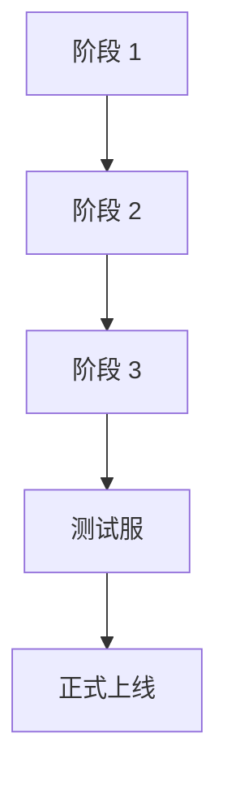

# PRD-XXXX: <一句话标题 / One-Line Title>

> 复制这份模板成 `workspace_human/prd/PRD-XXXX_短标题.md` 后填写。
> Copy this template into `workspace_human/prd/PRD-XXXX_short_title.md` to use.

- **起草人 / Author**: <name>
- **起草日期 / Date**: 2026-XX-XX
- **状态 / Status**: 草稿 / 评审中 / 已批准 / 实施中 / 已上线 / 已废弃
- **关联客户 / 业务线 / Related**: <如适用>
- **审阅人 / Reviewers**: <list>
- **前置 meeting / Discovery Input**: <meeting 路径 / 无>

---

## 状态变更日志 / Status History

- 2026-XX-XX 由 [name] 起草
- 2026-XX-XX 状态变为「评审中」

---

## 1. 背景与动机 / Context and Motivation

### 前置输入 / Discovery Inputs

- meeting / 密听纪要：...
- 客户 / 业务 / 一线反馈：...
- TUVE skill / config / Agent 上下文：`products/tuve/openclaw_context/`（如适用）

### 背景与动机 / Context and Motivation

（为什么要做这件事；不做会怎样；触发因素是什么）
（2-3 段话，让 6 个月后的人能复原情境）

---

## 2. 目标与非目标 / Goals and Non-Goals

### 目标 / Goals

- ✅ 目标 1：<可测量的具体目标>
- ✅ 目标 2：...
- ✅ 目标 3：...

### 非目标 / Non-Goals

- ❌ 非目标 1：<明确不做什么>（防止范围漂移）
- ❌ 非目标 2：...

---

## 3. 用户故事 / User Stories

按"作为 <角色>，我希望 <能力>，以便 <价值>" 格式：

- **故事 1**: 作为短视频运营，我希望能在客户后台首页看到本周新增内容的播放数据，以便快速判断哪些内容值得复制爆款。
- **故事 2**: ...
- **故事 3**: ...

---

## 4. 需求详述 / Requirements

### 4.1 功能需求 / Functional

- 4.1.1 ...
- 4.1.2 ...

### 4.2 非功能需求 / Non-Functional

- 性能 / Performance: ...
- 合规 / Compliance: ...
- 可观测性 / Observability: ...
- 回退方案 / Rollback: ...

---

## 5. 验收标准 / Acceptance Criteria

每条都必须可被打 ✅ / ❌：
Each must be checkbox-style ✅ / ❌:

- [ ] AC-1: <具体可验证条件>
- [ ] AC-2: ...
- [ ] AC-3: ...

---

## 6. 主次审视 / Priority Audit
> 仅 paywall / feature gate / 分层 PRD 必填。其他 PRD 删除本节。
> Only required for paywall / feature-gate / tiering PRDs.

详见 [`principles/subs/business_priorities.md`](../../principles/subs/business_priorities.md) §"主次审视"。

### 当前功能成熟度 / Current Maturity
- 上线时间：YYYY-MM-DD
- 已发现 Bug 数：N
- 客户主动反馈："好用" X% / "可用" Y% / "难用" Z%

### 真实成本差异 / Real Cost Differential
- 免费档单用户月成本：$X
- 付费档单用户月成本：$Y
- 差异显著吗（≥ 30%）？

### 真实用户价值差异 / Real Value Differential
- 免费档能完成的核心工作流：...
- 付费档多解锁的能力 + 客户主动表达过的 ROI 提升：...

### 主次审视结论 / Conclusion
- ✅ 通过 / ⚠️ 部分 / ❌ 未通过

---

## 7. 时间表 / Timeline

- 里程碑 1：YYYY-MM-DD <交付什么>
- 里程碑 2：YYYY-MM-DD <交付什么>
- 里程碑 3：YYYY-MM-DD <交付什么>

复评点 / Re-review checkpoints: <什么发生时回头看>

---

## 8. 风险与对策 / Risks and Mitigations

- **风险 1**：<描述>
  - 概率：高 / 中 / 低
  - 影响：高 / 中 / 低
  - 对策：<具体动作>
  - 触发条件：<什么发生时执行对策>
- **风险 2**：...

---

## 9. 待确认问题 / To-Be-Confirmed

如果还有没确认但不影响先进入评审的问题，写在这里；编号用 `H1 / H2 / H3`：

- [ ] H1：...
- [ ] H2：...

---

## 10. 决策记录 / Decisions

PRD 实施过程中冒出的取舍点。每条 mini-ADR 格式：

### 决策 10.1 - YYYY-MM-DD
- **背景**：实施 §X 时发现 ...
- **选项**：A / B
- **选择**：B
- **理由**：...

---

## 11. 实施记录 / Implementation Log
> 这是 AI 唯一可以追加的段。AI 不许改 §1-§10。
> The only section AI may append. AI must not edit §1-§10.

### YYYY-MM-DD 开工 / Kickoff
- 已读 PRD §1-§9
- 澄清问题（已问 + 已答）：...
- 实施路径草图：见 §11.1
- 预计完成：YYYY-MM-DD

### 11.1 Mermaid 实施图 / Implementation Diagram

### YYYY-MM-DD 里程碑 1 完成 / Milestone 1
- 完成功能：[1, 2, 3]
- commit：abc1234
- 状态：✅ 进行中

### YYYY-MM-DD 里程碑 N 完成 / Milestone N
- ...

---

## 12. 完成快照 / Completion Snapshot
> 完工时填。逐条核对 §5 验收标准。

- AC-1: ✅ 通过 / ⚠️ 部分 / ❌ 未做
- AC-2: ...
- AC-3: ...

⚠️ 和 ❌ 的项已登记到 [`issues/known.md`](../../issues/known.md)：是 / 否

---

## 13. 五件套收尾自查 / 5-Part Closeout Self-Check

- [ ] 测试：新功能冒烟 + 修 Bug 回归 + 反向断言清理
- [ ] 版本登记：[`runbooks/`](../../runbooks/) 或本 PRD 的"实施记录"
- [ ] PRD 完成快照：§12 已逐条核对
- [ ] 更新导航：[`AI_MANUAL.md`](../../AI_MANUAL.md) §4（如加了新工作流）
- [ ] Bug 移位：known → fixed/YYYY-MM-DD.md

任一缺失 → 不许说"完工"。
