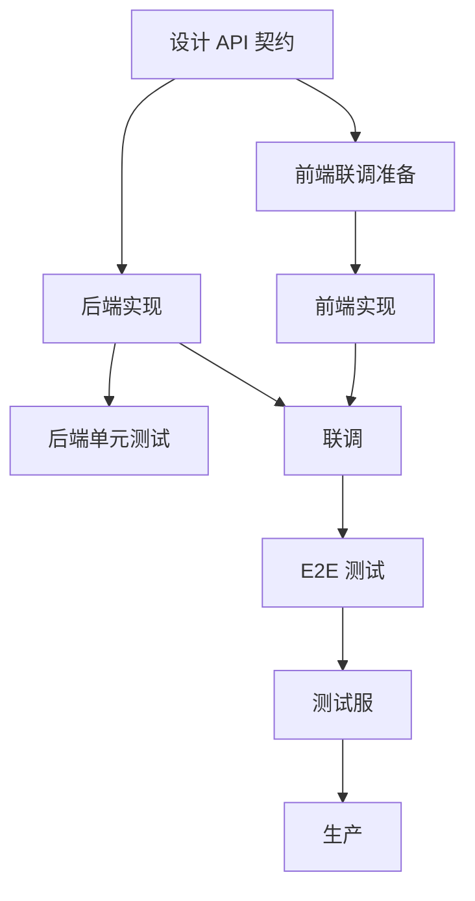

# PRD 到代码 / PRD to Implementation

> 适用：开发、技术 lead 接到一份 PRD 后，从理解到落地的完整流程。
> For: engineers / tech leads taking a PRD from understanding to merged code.

---

## 一句话 / One Line

**接到 PRD 不要立刻写代码。** 第一步是**读完 + 问清不确定**，第二步是**画实施草图**，第三步才是**动手**。
**Don't code immediately on receiving a PRD.** First read fully + clarify; then sketch implementation; only then code.

---

## 全生命周期 5 阶段 / 5 Phases of the Full Lifecycle

```
阶段 1: 理解 / Understand    (开工前)
   ↓
阶段 2: 草图 / Sketch       (开工前)
   ↓
阶段 3: 实施 / Implement    (执行)
   ↓
阶段 4: 验证 / Verify       (执行尾段)
   ↓
阶段 5: 收尾五件套 / 5-Part Closeout (执行后)
```

---

## 阶段 1：理解（不要跳）/ Phase 1: Understand (Don't Skip)

### 步 1：读完 PRD 一遍 / Step 1: Read the Full PRD

不是"扫一眼"，是从背景到非目标到验收一字不漏。
Not "skim", but every section: context, non-goals, acceptance.

### 步 2：列"不确定"的 top-3 / Step 2: List Top-3 Uncertainties

```
我读完了 PRD-XXXX。请帮我列出我可能遗漏的"不确定点"：
- §1 背景里：[我不确定 X]
- §3 用户故事：[我不确定 Y 是不是真的需求]
- §5 验收标准：[我不确定 Z 怎么测]

请补充我还应该问的问题。
```

把这些不确定**回去问 PRD 起草人**，确认了再开工。
Ask the PRD author. Confirm before starting.

红线 #5：改代码前必有 PRD。**含糊的 PRD = 没 PRD。**
Red Line #5: code requires PRD. **Ambiguous PRD = no PRD.**

### 步 3：在 PRD 顶部记开工 / Step 3: Note Kickoff in PRD

```markdown
## 实施记录 / Implementation Log

### 2026-XX-XX 开工 / Kickoff
- 已读 PRD §1-§N
- 已澄清的不确定点：[1, 2, 3]
- 实施路径草图：见 §草图段
- 预计完成时间：YYYY-MM-DD
```

注意：红线 #12，AI 在 [`workspace_human/`](../../workspace_human/) 下只能**追加 ## 实施记录**，不能改主体。
Reminder: AI may **append ## Implementation Log** only; not edit body (Red Line #12).

---

## 阶段 2：草图（不要跳）/ Phase 2: Sketch (Don't Skip)

### 画一份 Mermaid 节点图 / Draw a Mermaid Diagram



把它放到 PRD 的"实施记录" 段。
Put in the PRD's Implementation Log.

### 列出"我担心的 top-3 风险" / List Top-3 Risks

```
基于上面的草图，我担心：
1. 风险 1：[描述] → 对策：[具体]
2. 风险 2：...
3. 风险 3：...
```

写到 PRD 实施记录里。让产品 / 评审者看到风险。
Write into Implementation Log. Let PM / reviewers see.

---

## 阶段 3：实施 / Phase 3: Implement

### 切分提交 / Atomic Commits

每个 commit 解决**一件事**。如果一个 commit 同时改了 3 件不相关的事 → 拆。
Each commit solves **one thing**. Multi-thing commits → split.

```
fix: <对应 Bug 编号或 PRD 段号> - <一句话说为什么>
feat: <对应 PRD 段号> - <一句话说为什么>
refactor: <对应 PRD 段号> - <一句话说为什么>
test: <加了什么测试>
docs: <更新了什么文档>
```

PR title prefix: `feat:` / `fix:` / `refactor:` / `docs:` / `test:` / `chore:`

### 中途不确定 → 立刻问 / Mid-Flight Uncertainty → Ask

不要"我先按我的猜想做，做完再说"。猜错 = 全部重来。
Don't "guess and finish, ask later". Wrong guess = full redo.

### 中途决策 → 落字回 PRD / Mid-Flight Decisions → Back to PRD

```markdown
### 2026-XX-XX 中途决策
- 在实施 §4.2 时发现 [具体问题]
- 与 PRD 起草人讨论后决定：[决定]
- 已同步：PRD 主体段未改（红线 #12）；实施记录登记
- 影响：[对其他段的影响]
```

如果决策大到要改 PRD 主体段 → **由产品改**，不是 AI / 工程师改。
If big enough to touch PRD body → **PM edits**, not AI / engineer.

---

## 阶段 4：验证 / Phase 4: Verify

### 4 道关 / 4 Gates

#### 关 1：单元测试 / Unit Tests

- 新功能至少有冒烟测试 / Smoke test for new
- 修 Bug 必有回归测试 / Regression test for bugs
- 反向断言测试已清理（红线 #13）/ Reverse-assertions cleaned

#### 关 2：本地手动验证 / Manual Local

按 PRD 验收标准逐条手测一遍。
Walk through PRD acceptance criteria item-by-item locally.

#### 关 3：测试服 / Staging

部署到测试服，让一位**没参与开发**的同事按 PRD 验收手测。
Deploy to staging, have a **non-developer** colleague walk through.

#### 关 4：上线前自查表 / Pre-Deploy Checklist

参考 [`deployment_hygiene.md`](deployment_hygiene.md) 的清单。
See checklist in `deployment_hygiene.md`.

---

## 阶段 5：收尾五件套（红线 #10）/ Phase 5: Five-Part Closeout

任何一项缺失 → **禁止**用"完工"字眼。
Any missing → "done" is **banned**.

### 1. 测试 / Tests
- [ ] 单元测试新增 N 条
- [ ] 集成测试新增 M 条
- [ ] 反向断言测试已清理
- [ ] CI 全绿

### 2. 版本登记 / Version Registration
- [ ] 在 [`runbooks/`](../../runbooks/) 或对应 versions 文件登记
- [ ] 版本号 / 上线时间 / 主要改动（按红线 #2 客户面文案口径）

### 3. PRD 完成快照 / PRD Completion Snapshot
- [ ] 回到 PRD 验收段，每条 ✅ / ⚠️ / ❌
- [ ] ⚠️ 和 ❌ 的进 [`issues/known.md`](../../issues/known.md)

### 4. 更新导航 / Navigation
- [ ] 如加了新工作流 → 更新 [`AI_MANUAL.md`](../../AI_MANUAL.md) §4
- [ ] 如改了 [`runbooks/`](../../runbooks/) → 同步顶部索引

### 5. Bug 移位 / Bug Reclassification
- [ ] 这次修的 Bug 从 [`issues/known.md`](../../issues/known.md) 移到 [`issues/fixed/YYYY-MM-DD.md`](../../issues/fixed/)
- [ ] 整条搬过去（不是只写"修了 X"）

---

## "完工"措辞规则 / "Done" Wording Rules

任何一项五件套缺失，**禁止**用：
Missing any → **banned**:
- "完工 / Done"
- "全部搞定 / All set"
- "上线了 / Shipped"
- "圆满完成 / Successful"

允许 / Allowed:
- "代码已合，待补 X 测试"
- "已上测试服，正式服待 Y"
- "功能可用，缺 Z 文档更新"

诚实地说"剩 X 没做"比说"完工"再被发现强 100 倍。
Honest "X is pending" is 100× better than false "done".

---

## 速查 / Cheat Sheet

```
5 阶段：理解 → 草图 → 实施 → 验证 → 收尾五件套

不要跳的：理解段（必读完 + 问不确定）/ 草图段（Mermaid + 风险 top-3）

红线：#5 PRD 在前 / #10 五件套全 / #11 长 markdown 声明 retention / #12 PRD 主体不动 / #13 反向断言测试同步清

收尾五件套：测试 / 版本 / PRD 快照 / 导航 / Bug 移位
```
