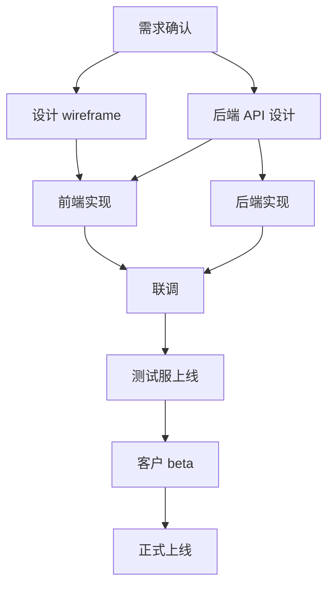

# 把一个项目拆成可执行的子任务 / Breaking Down a Project

> 适用：项目负责人、产品经理、跨职能协作发起人。
> For: project owners, product managers, cross-functional initiators.

---

## 一句话 / One Line

**好的拆分让每个子任务都有明确的负责人、明确的产出、明确的完成定义。**
**Good decomposition gives each subtask a clear owner, clear output, clear definition of done.**

含糊的拆分比不拆还糟，因为它给"看起来在动"的错觉。
Vague decomposition is worse than no decomposition — it creates the illusion of motion.

---

## 拆分前先做 3 件事 / Before Decomposing, Do 3 Things

### 1. 确认 PRD 完整 / Confirm the PRD is Complete

如果还没 PRD 或 PRD 不完整，**先回去补 PRD**。在不完整的 PRD 上拆分=拆错的。
If no PRD or incomplete, **fix the PRD first**. Decomposing on an incomplete PRD = decomposing wrong.

### 2. 列出关键决策点 / List Key Decision Points

在你拆任务之前，哪些事**没决定就拆不下去**？
Before decomposition, what hasn't been decided yet?

例：要做新的客户后台首页
Example: redesign customer dashboard
- 决定 1：新首页用现有数据还是要新加数据接口？
- 决定 2：移动端独立做还是响应式？
- 决定 3：上线方式是 A/B 测试还是全量切换？

这些决定**先拍板**，再拆任务。决策落字成 ADR（[`workflows/decision_records/`](../decision_records/)）。
Decide these **first**, then decompose. Record decisions as ADRs.

### 3. 列出已知的依赖 / List Known Dependencies

哪些子任务**依赖外部**（其他团队、第三方、客户）？这些任务的 ETA 不在你手上。
Which subtasks **depend on external** parties (other teams, 3rd parties, customers)? Their ETA is not in your hands.

依赖项要在拆分时**首先识别**，因为它们决定关键路径。
Identify dependencies **first** during decomposition — they determine the critical path.

---

## 拆分的"PROD"框架 / The "PROD" Framework

每个子任务必须回答 4 件事：
Each subtask must answer 4 things:

- **P**roduct（产出）：这个子任务完成时**具体的可交付物**是什么？/ What concrete deliverable?
- **R**esponsibility（负责人）：**一个**具体的人名（不是"运营组"也不是"我们"）/ One specific name (not "the ops team")
- **O**utcome（验收）：怎么知道它真的做完了？/ How to verify done?
- **D**eadline（截止）：具体到日期，不是"月底前" / Specific date, not "by month-end"

任何一条缺失 → 这不是一个子任务，是一个"模糊的事项"。
Any of the four missing → not a subtask, just a "vague item".

---

## 用 AI 协助拆分 / Decomposing with AI

```
背景：我要做 [项目名]。PRD 在下面（粘贴）。

请帮我把这个项目拆成子任务，每个子任务用 PROD 框架填：
- 产出：...
- 负责人：（用占位符 [Owner-X] 我之后填）
- 验收：...
- 截止：（用相对时间，"开工后 X 周"）

约束：
- 每个子任务 ≤ 3 个工作日的工作量
- 标出依赖关系（A 必须等 B 完成才能开始）
- 标出"外部依赖"（依赖其他团队 / 第三方 / 客户）
- top-5 风险单独列
```

AI 会给你一份初版。你（人）的责任是：
AI gives a first cut. Your (human) responsibility:
- 填具体负责人
- 填具体日期
- 把 ≥ 3 工作日的子任务再拆
- 削减"看起来重要但不在 PRD 范围"的子任务（红线 #5）

---

## 子任务的合理大小 / Right Size for a Subtask

经验：**每个子任务 ≤ 3 个工作日**。
Heuristic: **each subtask ≤ 3 workdays**.

理由：
Reason:
- 超过 3 工作日 → 进度反馈周期太长，你看不到风险信号 / Beyond 3 days → feedback cycle too long, you miss risk signals
- 小于 0.5 工作日 → 拆得太碎，跟踪开销超过价值 / Under 0.5 day → too granular, tracking overhead exceeds value

如果拆出来的子任务超过 3 工作日，**再拆一次**。
If a subtask exceeds 3 days, **decompose again**.

---

## 关键路径分析 / Critical Path Analysis

把所有子任务画成 DAG（有向无环图）：哪些可并行、哪些有依赖。
Draw all subtasks as a DAG: which can parallelize, which have deps.

**关键路径** = 从起点到终点的最长依赖链。
**Critical path** = the longest dependency chain from start to end.

关键路径上的任何一个子任务延期，整个项目就延期。
Any delay on the critical path delays the whole project.

操作：
Action:
- 把关键路径上的子任务**优先排期**
  Prioritize critical-path subtasks
- 关键路径上有外部依赖时，**周复盘必扫**
  External deps on critical path → check weekly
- 非关键路径的子任务可以推迟，但要在拆分图里**显式标记**为"非关键"
  Non-critical subtasks can slip but mark them explicitly

---

## 跨职能项目的特殊纪律 / Cross-Functional Special Discipline

涉及 ≥ 3 个职能（销售 / 运营 / 视频 / 产品 / 开发）时：
When ≥ 3 functions are involved:

1. **每个职能选一个 owner** —— 不是"销售组"，是"销售-Z" / One named owner per function
2. **每周开一次 30 分钟同步会** —— 周一上午，全员 + 主持人 / Weekly 30-min sync, Monday AM, all + chair
3. **同步会有标准模板** —— 见 [`templates/meeting_notes/cross_functional_weekly.md`](../../templates/meeting_notes/) / Template-driven
4. **会后纪要 24 小时内出**，落到 [`meetings/`](../../meetings/) / Notes within 24h, into `meetings/`
5. **谁的 owner 调整 → 立刻广播给所有 owners**，不要"我私下调一下" / Owner changes broadcast immediately

---

## 用 Mermaid 画拆分图 / Draw the Decomposition with Mermaid

在 PRD 末尾画一份 Mermaid 流程图，让所有职能一眼看到全貌：
At the end of the PRD, draw a Mermaid diagram so all functions see the whole picture:



每完成一个节点 → 在 PRD 里把对应节点标 ✅。
As nodes complete → mark ✅ in the PRD.

这同时是**进度可视化**和**对齐工具**。
Both **progress visualization** and **alignment tool**.

---

## 何时不拆细 / When NOT to Decompose Further

- **探索性 / 研究性任务**：你也不知道答案是什么，硬拆出来都是猜
  **Exploratory / research**: you don't know the answer; forced decomposition is just guessing
- **第一次做的事**：先做一个 spike（探索性快速试），探索完了再拆
  **First-time tasks**: do a spike first, decompose after
- **应急项目**：紧急情况下决策周期 > 任务周期，先做再说
  **Emergencies**: when decision-cycle > task-cycle, just do

这些情况下，先**给一个时间盒**（"我先花 4 小时探索，然后回来重新拆"），不必硬拆出 PROD。
In these cases, give a **timebox** ("4 hours exploring, then re-decompose"), not forced PROD.

---

## 拆完之后 / After Decomposing

- 把拆分图存到 PRD 里 / Save the diagram in the PRD
- 把每个子任务建到团队的任务管理工具（Jira / Linear / Notion / 飞书任务）/ Create each subtask in your task tool
- 在团队群广播一次：项目启动 + 关键路径 + 各职能 owner / Broadcast once: kickoff + critical path + per-function owners
- 第一次周同步会的时间定下来 / Schedule the first weekly sync
