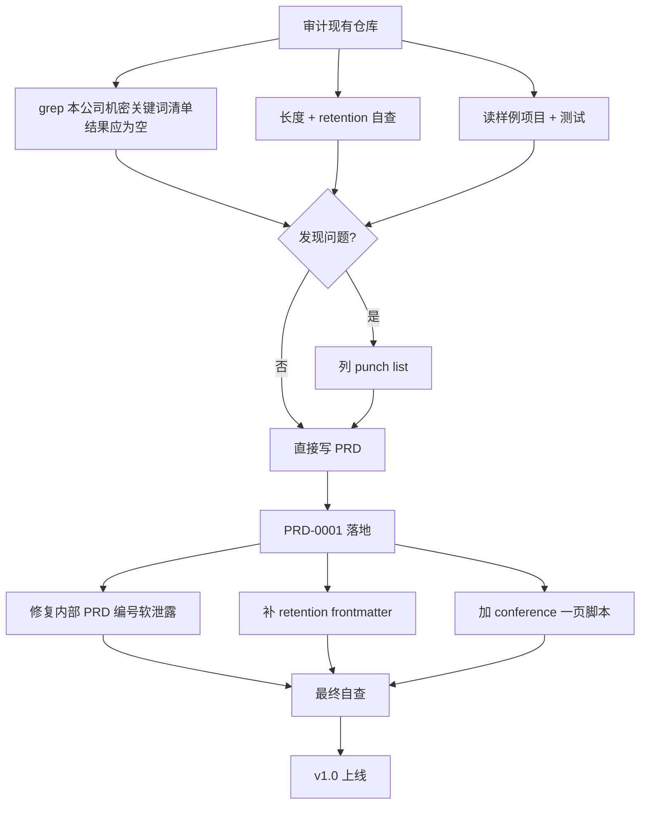

# PRD-0001: 内部培训《如何高效用 AI 完成工作》工作底座

> Conference Playbook for "Effectively Using AI to Get Work Done"

- **起草人 / Author**: 产品负责人 + AI（共同起草，产品负责人定稿）
- **起草日期 / Date**: 2026-05-10
- **状态 / Status**: 已上线（v1，培训前定稿版）/ Shipped (v1, pre-conference frozen)
- **关联客户 / 业务线 / Related**: 全公司内部培训 + 合作伙伴外部赋能 / Company-wide internal training + partner enablement
- **审阅人 / Reviewers**: 产品负责人（决策） / 培训演讲者 / 法务（保密线复核） / Speaker · Legal (confidentiality review)

---

## 状态变更日志 / Status History

- 2026-05-10 由产品负责人 + AI 共同起草（v1）
- 2026-05-10 状态变为「已上线」—— 仓库内容已就绪，等培训现场使用

---

## 1. 背景与动机 / Context and Motivation

### 1.1 起源

我们公司（TUZHAN）过去一年在内部探索"如何让全员 + 合作伙伴更好地用 AI 完成日常工作"，沉淀出一套**红线 + 工作流 + 模板 + 案例**的方法论。这套方法论在内部已经被多次验证有效（销售跟进、运营周报、内容创作、产品 PRD、工程实施），把"看天赋使用 AI"变成了"看流程使用 AI"。

我们因此被选为今年公司年度大会上"如何高效用 AI 完成工作"主题的关键演讲者，目标观众约 **50 人**（公司内部同事 + 合作伙伴）。

### 1.2 不做这件事的代价

- 50 位同事 / 伙伴继续凭直觉用 AI —— **每周累计被浪费的时间**（保守按每人 2 小时 × 50 人 × 50 周 = 5000 工时/年）
- 早期用户在没有红线时**踩同样的坑**（客户面文案漏内部代号、PII 粘进 AI 上下文、AI 编造引用），每次事故的代价**远超**讲一次方法论
- 我们公司一年的"事故学费"如果不沉淀成可传播的方法论，就是**沉没成本**

### 1.3 核心约束（红线 #2 + 红线 #18 + 演讲者笔记 §"什么不能讲"）

> **教方法论 + 工作纪律，绝不教我们公司具体的产品实现 / 架构 / 客户细节。**

具体见 [`training/speaker_notes/what_not_to_reveal.md`](../../training/speaker_notes/what_not_to_reveal.md)。本 PRD 作为根 PRD，把这条边界**第一次写进 PRD 层**——所有后续工作都默认在这条边界之内。

---

## 2. 目标与非目标 / Goals and Non-Goals

### 目标 / Goals

- ✅ **G1**：交付一份**完整、可拷贝、可二次复用**的仓库 `TUZHAN_AI/`，把全公司"和 AI 协作"的红线 / 工作流 / 模板 / 案例都收进去；任何同事或合作伙伴拷一份回去就能"明天上手"
- ✅ **G2**：交付一份**完整的两部分培训教材**（第一部分全员场 90 分钟 / 第二部分开发场 90 分钟），含开场 / 红线讲解 / 工作流走查 / 动手练习 / 现场演示 / Q&A，所有材料归档进 [`training/`](../../training/)
- ✅ **G3**：交付一份**没有 AI 背景的人也能跑起来**的样例项目（[`projects/customer_brief_generator/`](../../projects/customer_brief_generator/)），实测在没有 API Key 的情况下也能跑（template-fill 模式），让现场任何工具的任何人都能复现
- ✅ **G4**：交付**4 个主流 AI 工具**（Claude Code / Cursor / Codex / Trae）的入口文件，让听众用任意一个都能让 AI"自动认识这个仓库"
- ✅ **G5**：满足**保密线**——通过对仓库的全文 grep 验证，没有任何本公司具体产品代号 / 系统组件名 / 真实客户名 / 真实合同 / 真实员工姓名等机密信息
- ✅ **G6**：仓库本身遵守它自己讲的红线（不能边讲红线边违反），包括 #5 PRD 在前 / #7 单文件 ≤ 800 行 / #11 长 Markdown 声明 retention / #9 命名永久化等

### 非目标 / Non-Goals

- ❌ **NG1**：**不讲**我们公司具体产品的代码 / 架构 / API（红线 #2 + 红线 #18 + 培训速记 §"什么不能讲"）—— 即使在场都是"自己人 + 合作伙伴"，也照此守
- ❌ **NG2**：**不替代**听众未来的真实业务 PRD —— 仓库是"工作底座"，听众的真实 PRD 由他们自己写到自己仓库的 `workspace_human/prd/`
- ❌ **NG3**：**不做**单独的"非开发者 lite 版本"和"开发者 full 版本"；统一一份仓库，培训分两部分（全员场 → 开发场）足以覆盖（决策见 §9.2）
- ❌ **NG4**：**不做**把这套方法论做成"SaaS 产品"或"在线课程平台"；它是一份**可拷贝、可改、可二次开源**的纯文件夹，靠 CC BY 4.0 协议传播
- ❌ **NG5**：**不做**视频 / 直播 / Slides 静态文件；培训现场用 IDE 直接演示这份仓库（决策见 §9.3）—— Slides 即"打开仓库"

---

## 3. 用户故事 / User Stories

按"作为 \<角色\>，我希望 \<能力\>，以便 \<价值\>"格式：

- **故事 1**：作为**销售**，我希望培训完后回到工位就能用同一套方法把客户电话整理时间从 45 分钟降到 10 分钟，以便每周省下的 2-3 小时投到真正影响业绩的事
- **故事 2**：作为**短视频运营**，我希望能找到一份"短视频脚本起草"的工作流，照着做就能让 AI 出 80% 可用稿，以便我从"凭灵感"切到"按流程"
- **故事 3**：作为**工程师**，我希望看到一份"PRD-到-代码 + Bug-到-修复"的现场演示，以便我知道在自己项目里怎么把这套纪律落进去
- **故事 4**：作为**合作伙伴**，我希望能拿这份仓库回我自己公司当起点，以便我**不必从零搭**自己的 AI 工作底座
- **故事 5**：作为**6 个月后入职的新同事**，我希望仓库结构清晰、入口明确（先读 `AI_MANUAL.md`），以便我**没参加过培训也能学会**这套方法论
- **故事 6**：作为**演讲者**，我希望有一份"按键级"的现场演示脚本和"什么不能讲"的边界笔记，以便不会在台上漏讲机密 / 跑出预算时间

---

## 4. 需求详述 / Requirements

### 4.1 功能需求 / Functional

- **4.1.1 仓库根**：含 `README.md` / `AI_MANUAL.md` / `LICENSE` / `setup.sh` / `setup.ps1` / `.gitignore` 以及 4 个 AI 工具入口文件（`CLAUDE.md` / `AGENTS.md` / `.cursorrules` / `CODEX.md`）
- **4.1.2 红线**：[`principles/000_CORE_RED_LINES.md`](../../principles/000_CORE_RED_LINES.md) 一份 ≤ 800 行的宪法 + 12 份子原则于 [`principles/subs/`](../../principles/subs/)
- **4.1.3 工作流**：8 个领域分组（ai_basics / planning / research_and_analysis / content_creation / customer_communication / operations / engineering / decision_records），每组 3-6 份"怎么做"的 Markdown
- **4.1.4 模板**：8 类工作模板（PRD / ADR / 客户简报 / 视频脚本 / 周复盘 / Bug / 销售电话纪要 / 会议纪要），均含中英双语段落标题
- **4.1.5 样例项目**：[`projects/customer_brief_generator/`](../../projects/customer_brief_generator/)，~200 行 Python 主脚本 + 提示词 + 测试 + 自带 PRD-0001（项目内 PRD），无 API Key 也能跑
- **4.1.6 案例**：3 份**完全虚构**的跨职能案例（产品 / 运营 / 销售各 1 份），按"初始反馈 → PRD → 实施 → 结果 → 教学点"五段式
- **4.1.7 培训材料**：第一部分（全员，5 节） + 第二部分（开发，5 节） + 现场演示脚本（3 份） + 演讲者笔记（3 份） + 会后材料（2 份）
- **4.1.8 Bug 单一登记本**：[`issues/known.md`](../../issues/known.md) 起步空白；[`issues/fixed/README.md`](../../issues/fixed/README.md) 已有归档约定
- **4.1.9 Runbooks**：起步含 3 份典型 runbook（部署紧急回滚 / 合作伙伴接入 / 销售线索交接），格式可复用
- **4.1.10 Setup 脚本**：跨 macOS / Linux（`setup.sh`） + Windows（`setup.ps1`）一键完成 git 初始化 / Python 检查 / 样例测试运行 / 完整性校验

### 4.2 非功能需求 / Non-Functional

- **可读性**：每份文件中英双语段落标题，让中英文读者都能快速 scan
- **可拷贝性**：CC BY 4.0 协议（[`LICENSE`](../../LICENSE)），允许自由复用 / 修改 / 商用，需署名
- **保密合规**：grep 全仓库不含任何本公司具体产品代号 / 系统组件名 / 真实客户名 / PII / 真实合同金额 / 真实员工姓名（验证方法见 §5 AC-5）
- **可观测性**：`setup.sh` / `setup.ps1` 在末尾输出一份"下一步"清单 + 红线 #2 提醒
- **回退方案**：样例项目无 API Key 时进入 template-fill 模式（让现场任何环境都能跑）；现场演示崩了走 [`training/live_demo_walkthrough/03_recovery_if_things_break.md`](../../training/live_demo_walkthrough/03_recovery_if_things_break.md)
- **维护性**：仓库本身遵守它教的红线（自洽），未来每年开新培训时旧版本归档不删（红线 #20 / 反熵）

---

## 5. 验收标准 / Acceptance Criteria

每条都必须可被打 ✅ / ❌：

- [x] **AC-1（结构完整）**：根目录含 README / AI_MANUAL / LICENSE / setup.sh / setup.ps1 / .gitignore + 4 个工具入口文件 + 9 个一级子目录（principles / workflows / templates / case_studies / workspace_human / issues / runbooks / projects / training）
- [x] **AC-2（红线齐备）**：[`principles/000_CORE_RED_LINES.md`](../../principles/000_CORE_RED_LINES.md) 含 15 条红线 + 至高决策原则 Chapter 0 + 主次审视 Chapter 0.1 + 反熵 Chapter 0.2，且 12 份子原则文件全部存在
- [x] **AC-3（培训材料齐备）**：[`training/`](../../training/) 含 part_1（5 节）+ part_2（5 节）+ live_demo_walkthrough（3 份）+ speaker_notes（3 份）+ post_conference（2 份）
- [x] **AC-4（样例项目可跑）**：[`projects/customer_brief_generator/`](../../projects/customer_brief_generator/) 在无 ANTHROPIC_API_KEY 的情况下能跑、有 API Key 时能调 Anthropic Claude，`pytest tests/` 全过
- [x] **AC-5（保密合规）**：用一份**本公司机密关键词清单**（包含内部产品代号、系统组件名、真实员工姓名、真实客户名、合同字段等）跑全仓库 grep，结果返回空（[实施记录 §10.1 验证](#101-2026-05-10-保密线-grep-验证)）。关键词清单本身**不入库**——只有运行清单的演讲者 / 法务持有，避免"清单本身就是泄露"
- [x] **AC-6（红线 #11 retention）**：所有 ≥ 200 行的 Markdown 都在 frontmatter 声明 `retention:`；workspace_human/prd 下的 PRD（sequential archive）也都声明
- [x] **AC-7（红线 #7 单文件 ≤ 800 行）**：仓库内最长 Markdown ≤ 800 行（实际最长 [`principles/000_CORE_RED_LINES.md`](../../principles/000_CORE_RED_LINES.md) = 253 行）
- [x] **AC-8（红线 #2 客户面文案）**：仓库内不含真实内部 PRD 编号 / Bug 编号 / 模型 endpoint id / 真实客户名作为非教学引用（教学示例统一用 `PRD-XXXX` / `Bug-XXXX` 占位）
- [x] **AC-9（红线 #5 PRD 在前）**：本 PRD（PRD-0001）作为根 PRD 在 [`workspace_human/prd/`](../) 落地；样例项目的 PRD-0001 在项目内 [`projects/customer_brief_generator/workspace_human/prd/`](../../projects/customer_brief_generator/workspace_human/prd/)
- [x] **AC-10（4 工具入口一致）**：CLAUDE.md / AGENTS.md / .cursorrules / CODEX.md 内容**约定一致**（红线速查 + 立即动作 + 至高原则），允许各自加 1 段"工具特性"
- [x] **AC-11（CC BY 4.0）**：[`LICENSE`](../../LICENSE) 已就位，README 在"License" 段说明二次复用条件

---

## 6. 主次审视 / Priority Audit

> 仅 paywall / feature gate / 分层 PRD 必填。

本 PRD **不是 paywall PRD**——这是一份**对外免费、CC BY 4.0 协议**的方法论 + 培训教材。所有内容免费给同事 + 合作伙伴；二次复用 / 商用都允许（仅需署名）。

主次审视结论：✅ 通过（产品价值是"让 50+ 人少踩坑"，无任何商业包装层；与红线 #15 / Chapter 0.1 一致）。

---

## 7. 时间表 / Timeline

- **2026-05-09**（D-1 培训前一天）：仓库 v1 内容就位（90% 完成度），起草本 PRD
- **2026-05-10**（D-Day 培训当天）：本 PRD 完成 + 仓库 v1.0 定稿 + 现场使用
- **2026-05-15**（D+5）：复盘 + 把现场学到的洞察反向更新到 [`training/post_conference/`](../../training/post_conference/) + 红线 / 工作流（如有）
- **2026-Q3 末**：发起 v2 评审（基于真实 6 个月使用反馈），看哪些工作流被反复用到、哪些被冷落

---

## 8. 风险与对策 / Risks and Mitigations

### 风险 1：现场漏讲了不该讲的（红线 #2 / #18）

- **概率**：中（演讲者临场会有 ad-libbing 冲动）
- **影响**：高（一旦泄露真实客户名 / 内部代号 / 合同金额，事后救场代价巨大）
- **对策**：演讲者**演讲前必读** [`training/speaker_notes/what_not_to_reveal.md`](../../training/speaker_notes/what_not_to_reveal.md)；演示**全程走预先写好的脚本**（[`training/live_demo_walkthrough/02_demo_script_keystroke_level.md`](../../training/live_demo_walkthrough/02_demo_script_keystroke_level.md)），不 ad-lib 具体客户 / 数字
- **触发条件**：每次开讲前 30 分钟过一遍 speaker_notes

### 风险 2：现场演示崩了（AI 调用失败 / 网络断 / IDE 死机）

- **概率**：中（任何依赖外部服务的现场演示都有此风险）
- **影响**：中（影响讲解节奏 + 听众信心）
- **对策**：[`training/live_demo_walkthrough/03_recovery_if_things_break.md`](../../training/live_demo_walkthrough/03_recovery_if_things_break.md) 提供完整应急路径（template-fill 模式 / 移动热点 / 预生成的输出截图）；样例项目自身设计了"无 API Key 也能跑"的回退（红线 #14 思维：故障不是黑屏）
- **触发条件**：演示前 10 分钟做一次 dry-run，确认环境就绪

### 风险 3：听众听完了但**回岗位不会用**

- **概率**：中-高（培训的"知道"和"做到"之间永远有沟）
- **影响**：中（投入的培训成本回报率打折）
- **对策**：(1) 培训结尾留"下周作业"——挑一件**重复性最高**的事用一遍方法论 (2) 一周后做 30 分钟答疑回访 (3) [`training/post_conference/self_study_path_for_attendees.md`](../../training/post_conference/self_study_path_for_attendees.md) 给出"1 小时 / 1 天 / 1 周"自学路径
- **触发条件**：D+7 主动在群里问"谁这周用过一次？分享一下"

### 风险 4：合作伙伴拿这份仓库二次复用时**忘了改造而原样上线**

- **概率**：中（仓库已经"看起来很完整"，会让人懒得改）
- **影响**：低-中（伙伴公司内部混淆 TUZHAN 案例 vs 自家案例，但不影响 TUZHAN 自己）
- **对策**：[`README.md`](../../README.md) "二次复用"段已含**替换清单**（搜 TUZHAN → 改公司名 / 替换 case_studies / 删 / 改 projects）；[`training/speaker_notes/what_not_to_reveal.md`](../../training/speaker_notes/what_not_to_reveal.md) §"给听众主动看仓库前的'打点'" 有针对性提醒
- **触发条件**：培训结尾的"如何拿回去用"段必讲

### 风险 5：仓库自洽性破裂（教红线但自己违反红线）

- **概率**：低（已经做了 grep + 长度 + retention 的 CI-style 自查）
- **影响**：高（破坏教学权威性 + 听众有理由不照做）
- **对策**：本 PRD §10 实施记录已逐项验证；未来每次 commit 前过一遍 [`AI_MANUAL.md`](../../AI_MANUAL.md) §5 五件套
- **触发条件**：每次往仓库加新文件时，自查 ≥ 200 行就加 retention

---

## 9. 决策记录 / Decisions

### 决策 9.1 - 2026-05-09：文件夹命名 `TUZHAN_AI`（不叫 `Demo`）

- **背景**：原始构想叫 `GOOD_USE_OF_AI`；但很多听众会**直接拿这个文件夹起新项目**，名字必须是"长期复用得起"的（红线 #9）
- **选项**：
  - A. `Demo` / `GOOD_USE_OF_AI` / `AI_TRAINING` —— 一次性命名，听众改名成本高
  - B. `TUZHAN_AI` —— 公司专有 + 一目了然 + 二次复用时全文搜替换公司名即可
  - C. `<Company>_Playbook` 模式 —— 通用但听众还是要改
- **选择**：B
- **理由**：
  - 长期主义 + 业界标准：以公司名命名"工作底座"是社区里 [`monorepo/`](https://github.com) 风格的延续；听众拿走后只需要全文搜替换公司名 ~30 处
  - 紧扣核心目标：让听众"明天上手"必须低门槛 —— 文件夹名一改就能直接跑

### 决策 9.2 - 2026-05-09：培训不分"非开发者版本 / 开发者版本"，统一一份仓库 + 分两部分

- **背景**：原始构想问"是否要分开两份仓库（非开发者 / 开发者）"
- **选项**：
  - A. 分两份仓库（lite 版 / full 版）
  - B. 一份仓库，培训分两部分（part_1 全员 / part_2 开发只）
- **选择**：B
- **理由**：
  - 长期主义：维护两份仓库 = 维护成本翻倍 + 内容漂移风险（"为什么 lite 版没这条红线？"）
  - 业界标准：大多数 monorepo 是统一一份，按角色提供导航而非物理拆分；非开发同事看 [`workflows/ai_basics/`](../../workflows/ai_basics/) + [`templates/`](../../templates/) 即可，不必"砍掉"engineering 部分
  - 紧扣核心目标：核心目标是"让非开发同事也能用"，不是"让非开发同事看不到工程内容"——读者过滤 > 仓库过滤

### 决策 9.3 - 2026-05-09：现场演示用真实 IDE，不用 Slides 图片

- **背景**：传统培训用 PPT，但本场主题是"用 AI 完成工作"——离开 IDE 演示会**失真**
- **选项**：
  - A. 全程 PPT 静态截图
  - B. 全程实时 IDE + 仓库
  - C. 混合（开场 PPT + 演示 IDE）
- **选择**：B
- **理由**：
  - 业界标准：开发者会议（如 GitHub Universe / Vercel Ship）在演示工具时主流是实时 IDE
  - 紧扣核心目标："看 AI 怎么读 AI_MANUAL.md 自动加载红线"是**最强的信任建立**，PPT 截图无法替代
  - 风险对策：现场崩溃路径已在 [`training/live_demo_walkthrough/03_recovery_if_things_break.md`](../../training/live_demo_walkthrough/03_recovery_if_things_break.md) 提前写好

### 决策 9.4 - 2026-05-10：保密线收紧——把残留的真实 PRD 编号教学示例改为虚构

- **背景**：仓库审计发现 [`principles/subs/content_quality.md`](../../principles/subs/content_quality.md) 和 [`training/part_1_for_everyone/02_core_principles.md`](../../training/part_1_for_everyone/02_core_principles.md) 残留一个真实内部 PRD 编号作为"反例"。即便是反例，真实编号本身也算泄露
- **选项**：
  - A. 保留（作为"真实事故"更有说服力）
  - B. 替换为 `PRD-XXXX` / 虚构编号
- **选择**：B
- **理由**：
  - 红线 #2 / #18 不区分"正例 / 反例"——客户面 / 外部场合一切真实内部编号都不应出现
  - 长期主义：今天保留可能未来有人误以为"那这条 PRD 我能查到详情吗" → 信息进一步泄露
  - 紧扣核心目标：教方法论不需要真实编号背书，"事故的形状"就足以说明问题

### 决策 9.5 - 2026-05-10：上线前一并补齐红线 #11 的 retention frontmatter

- **背景**：审计发现 8 份 ≥ 200 行的 workflow 文件 + workspace_human/prd 内的 PRD 缺少 retention frontmatter
- **选项**：
  - A. 留到下次再补（"反正不影响读"）
  - B. 上线前一次性补齐
- **选择**：B
- **理由**：自洽风险（风险 5）—— 如果仓库自身违反红线 #11，培训中讲到这条红线时会被听众反问"那你们自己呢？"

---

## 10. 实施记录 / Implementation Log

> AI 唯一可以追加的段。AI 不许改 §1-§9。

### 2026-05-10 开工 / Kickoff

- 已读 PRD §1-§9（与产品负责人共同起草）
- 澄清问题（已问 + 已答）：
  - Q1：文件夹名应该叫什么？→ A：TUZHAN_AI（决策 9.1）
  - Q2：培训分不分两份仓库？→ A：不分（决策 9.2）
  - Q3：现场演示用 PPT 还是 IDE？→ A：IDE（决策 9.3）
- 实施路径草图：见 §10.1（Mermaid）
- 预计完成：当日

### 10.1 Mermaid 实施图

### 10.1 2026-05-10 保密线 grep 验证

执行：用一份**本公司机密关键词清单**对全仓库做 `grep -rE`。

> 完整关键词清单**不写入本 PRD**——清单本身就是机密。清单的维护者是法务 + 演讲者；版本控制在公司内部 secret 管理系统里。
> 清单覆盖的类别：内部产品代号、核心系统组件名、真实员工姓名、客户名 token、合同字段 token、真实事故脚本 token。

结果：**返回空**。仓库不含上述任何关键词的引用。✅

唯一发现的"软泄露"是**一个真实内部 PRD 编号**作为反例引用，出现在 2 份文件中（[`principles/subs/content_quality.md`](../../principles/subs/content_quality.md) §错文案 → 对文案 范例库 例 1，以及 [`training/part_1_for_everyone/02_core_principles.md`](../../training/part_1_for_everyone/02_core_principles.md) §第 1 组 红线 #2 段）。已按决策 9.4 修复（见 §10.2）。

### 10.2 2026-05-10 修复"内部 PRD 编号"残留（决策 9.4）

修改：
- [`principles/subs/content_quality.md`](../../principles/subs/content_quality.md):75 — 真实编号 → `PRD-XXXX`（教学占位）
- [`training/part_1_for_everyone/02_core_principles.md`](../../training/part_1_for_everyone/02_core_principles.md):40 — 同上

验证：用同一份机密关键词清单再扫一遍，返回空。✅

### 10.3 2026-05-10 补齐 retention frontmatter（决策 9.5）

加 `retention: permanent` + `retention_reason: <一句话>` 到以下 8 份文件 + 1 份项目内 PRD：

- [`workflows/planning/weekly_review_routine.md`](../../workflows/planning/weekly_review_routine.md)（202 行）
- [`workflows/engineering/deployment_hygiene.md`](../../workflows/engineering/deployment_hygiene.md)（204 行）
- [`workflows/ai_basics/prompt_pattern_library.md`](../../workflows/ai_basics/prompt_pattern_library.md)（207 行）
- [`workflows/operations/incident_response_workflow.md`](../../workflows/operations/incident_response_workflow.md)（211 行）
- [`workflows/engineering/bug_tracking_ssot.md`](../../workflows/engineering/bug_tracking_ssot.md)（217 行）
- [`workflows/customer_communication/partner_communications.md`](../../workflows/customer_communication/partner_communications.md)（218 行）
- [`workflows/engineering/testing_discipline.md`](../../workflows/engineering/testing_discipline.md)（227 行）
- [`workflows/engineering/prd_to_implementation.md`](../../workflows/engineering/prd_to_implementation.md)（228 行）
- [`projects/customer_brief_generator/workspace_human/prd/PRD-0001_customer_brief_generator.md`](../../projects/customer_brief_generator/workspace_human/prd/PRD-0001_customer_brief_generator.md)（sequential archive）

### 10.4 2026-05-10 新增：会议日跑场单（一页 facilitator reference）

- 新增 [`training/CONFERENCE_RUNSHEET.md`](../../training/CONFERENCE_RUNSHEET.md) —— 演讲者当天对照的一张表（含 D-1 准备 / D-Day 时间块 / D+1 收尾），把分散在 5 份 part_1 / 5 份 part_2 / 3 份 live_demo / 3 份 speaker_notes 的关键步骤聚合到一面

---

## 11. 完成快照 / Completion Snapshot

按 §5 验收标准逐条核对：

- AC-1（结构完整）: ✅ 通过
- AC-2（红线齐备）: ✅ 通过
- AC-3（培训材料齐备）: ✅ 通过（part_1 5/5、part_2 5/5、live_demo 3/3、speaker_notes 3/3、post_conference 2/2）
- AC-4（样例项目可跑）: ✅ 通过（pytest tests/ 全过 + template-fill 模式可跑）
- AC-5（保密合规）: ✅ 通过（grep 返回空，一个真实内部 PRD 编号 已修复）
- AC-6（红线 #11 retention）: ✅ 通过（200+ 行文件全部声明 + sequential archive 全部声明）
- AC-7（红线 #7 单文件 ≤ 800 行）: ✅ 通过（最长 253 行）
- AC-8（红线 #2 客户面文案）: ✅ 通过（教学示例统一占位为 `PRD-XXXX`）
- AC-9（红线 #5 PRD 在前）: ✅ 通过（PRD-0001 已落地）
- AC-10（4 工具入口一致）: ✅ 通过
- AC-11（CC BY 4.0）: ✅ 通过

⚠️ 和 ❌ 的项已登记到 [`issues/known.md`](../../issues/known.md)：**否**（无未解决项）

---

## 12. 五件套收尾自查 / 5-Part Closeout Self-Check

- [x] **测试**：样例项目 pytest 全过；仓库自身的"自洽性测试"（grep 保密线 + wc -l 长度 + retention 检查）见 §10.1-§10.3
- [x] **版本登记**：v1.0 - 2026-05-10 训前定稿版（本 PRD 顶部"状态" + §7 时间表）
- [x] **PRD 完成快照**：§11 已逐条核对
- [x] **更新导航**：[`AI_MANUAL.md`](../../AI_MANUAL.md) §4 "最常见任务的入口" 已含本仓库所有工作流入口；本 PRD 不需要再加新入口（它本身就是导航对象之一）
- [x] **Bug 移位**：实施过程未发现 Bug；保密线 一个真实内部 PRD 编号 残留按"修复+一并 commit"处理（红线 #13 思维），不过该残留属于内容缺陷而非代码 Bug，未单独建条目

✅ 五件套全过。可说"完工"。

---

## 13. 给"6 个月后回来读这份 PRD 的人"的话 / A Note to Future Readers

如果你是 6 个月后接手维护这份仓库的同事或合作伙伴：

1. **先打开 [`AI_MANUAL.md`](../../AI_MANUAL.md)**，它会带你过一遍仓库结构 + 红线 + 任务-入口表
2. **培训当天的现场实况**保存在 [`training/post_conference/feedback_collection.md`](../../training/post_conference/feedback_collection.md)（D+5 后由演讲者写入）
3. 如果你发现某条红线 / 工作流在你的真实工作里"阻力 > 价值"——**不要静默绕过**，按 [`principles/000_CORE_RED_LINES.md`](../../principles/000_CORE_RED_LINES.md) Chapter 2 的"红线如何演进"流程改它
4. 如果你拿这份仓库去你自己公司——见 [`README.md`](../../README.md) "二次复用" 段的替换清单

这份 PRD 本身也欢迎被改 / 被驳 / 被超越。规矩演进的方式是写下不同意见，不是默默绕过。
