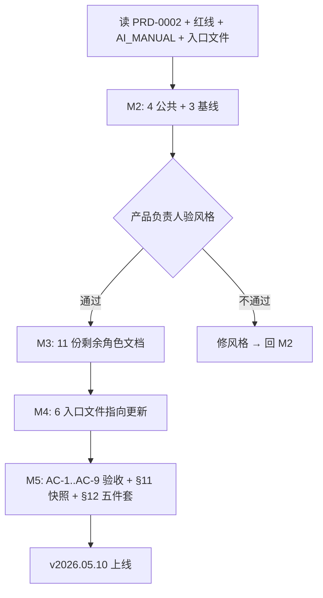

# PRD-0002: 按角色分组的新人开局引导（getting_started）

> Role-Based Getting-Started Onboarding for First-Time Repo Users

- **起草人 / Author**: 产品负责人 + AI（共同起草，产品负责人定稿）/ Product owner + AI (co-drafted, owner finalizes)
- **起草日期 / Date**: 2026-05-10
- **状态 / Status**: 草稿，待评审 / Draft, pending review
- **关联客户 / 业务线 / Related**: 全公司新人 onboarding + 合作伙伴二次复用 / Company-wide new-hire onboarding + partner reuse
- **审阅人 / Reviewers**: 产品负责人（决策） / 各业务线代表（角色文档准确性复核）

---

## 状态变更日志 / Status History

- 2026-05-10 由产品负责人 + AI 共同起草（v0.1 草稿）
- 2026-05-10 v0.2 草稿：自审发现并修复 6 处问题（P1 段落约束算术不自洽 → 切换为字数约束 / P2 §12 版本号写法错 → 改日期版本 / P3 §5 AC-7 grep 不可执行 → 改为人工 spot-check + grep 辅助 / P4 §8 漏关键风险 → 加风险 6 / P5 §5 AC-6 没说执行人 → 补 / P6 §7 里程碑 2 没说基线选择理由 → 补）

---

## 1. 背景与动机 / Context and Motivation

### 1.1 起源

在 [PRD-0001](PRD-0001_conference_playbook_for_using_ai_at_work.md) 把"工作底座 + 培训教材"交付完后，仓库面对**两类用户**：

- **A 类**：参加过培训的同事 —— 有 [training/post_conference/self_study_path_for_attendees.md](../../training/post_conference/self_study_path_for_attendees.md) 的"1 小时 / 1 天 / 1 周"自学路径作为复习入口
- **B 类**：**没参加过培训**的同事 / 合作伙伴 / 6 个月后入职的新人 —— 他们打开仓库看到 **25+ 个一级文件 / 9 个目录 / 数百份 Markdown**，第一反应是"我在哪？我该读什么？"

[README.md](../../README.md) 现有的"5 分钟快速开始"解决的是"如何让 AI 工具认识这个文件夹"——这是工具配置层的问题。但**真正卡住 B 类用户的不是工具配置**，是"我作为销售/视频/运营/数据……今天打开仓库后，**第一句和 AI 说什么**"——这一份目前**没有**。

### 1.2 不做这件事的代价

- 没参加培训的同事**直接放弃**这份仓库，回去继续凭直觉用 AI —— PRD-0001 G1 的"明天上手"承诺**对这一类用户失效**
- 合作伙伴拿走仓库二次复用时，他们的团队**也是 B 类用户** —— "可拷贝、可二次复用"的承诺在 onboarding 层断裂
- 6 个月后入职的新人没人陪着读，凭好奇心摸索的失败率**高于**有路径指引的成功率，按 50% 计 = 一半新人**永远没用上**这套方法论
- 我们公司"事故学费"沉淀成的方法论，**死在最后一公里的入口**

### 1.3 核心约束

> **教"开局怎么走"，不教方法论本身——方法论本身留给 [workflows/ai_basics/](../../workflows/ai_basics/)。**

getting_started 是**入口**，不是"压缩版方法论"。它的任务是**把人从冷启动状态推进到第一次有效会话**，然后把人交给已有的 workflows / templates / self_study_path 体系。任何把方法论再讲一遍的诱惑都要拒绝（防止"两份真相"），违反这条等于违反红线 Chapter 0.2 反熵。

---

## 2. 目标与非目标 / Goals and Non-Goals

### 目标 / Goals

- ✅ **G1 · 角色入口**：交付**14 份角色专属开局文档**（13 业务流岗位 + 1 跨职能兜底），覆盖短视频 AI Agent 团队从客户接触到产品交付的全业务流（前端 / 研发 / 运营内容 / 兜底），每份独立可读
- ✅ **G2 · 逐字脚本**：每份角色文档**必须**含至少 1 条"第一次和 AI 的对话"逐字脚本，新人复制即用，零思考成本开口
- ✅ **G3 · 三时间盒**：每份角色文档结构固定为 5 段（身份场景 → 第一句脚本 → 本周三件事 → 三个常见坑 → 下一步），让新人 ≤ 5 分钟读完一份
- ✅ **G4 · 不重复造轮子**：所有"方法论 / 红线 / 工作流 / 模板"**只链不抄**，依赖现有 [workflows/ai_basics/](../../workflows/ai_basics/) / [principles/](../../principles/) / [templates/](../../templates/) / [self_study_path](../../training/post_conference/self_study_path_for_attendees.md)；getting_started 自身不复述任何已存在的内容
- ✅ **G5 · 入口可达**：在 [README.md](../../README.md) "这个文件夹是给谁用的"上方加一行"第一次来 → `training/getting_started/`"，在 [AI_MANUAL.md](../../AI_MANUAL.md) §4 任务-入口表加一行"不知道从哪开始 → `training/getting_started/`"——让 B 类用户**找得到**这份引导
- ✅ **G6 · 自洽**：所有新文件遵守仓库自己的红线（红线 #7 单文件 ≤ 800 行 / #11 长文件声明 retention / #9 命名永久化 / #2 不含内部信息）

### 非目标 / Non-Goals

- ❌ **NG1**：**不替代** [workflows/ai_basics/](../../workflows/ai_basics/) 的 30 分钟基础课 —— getting_started 是"开局"，ai_basics 是"地基"，新人在 getting_started 跑过几次后**应该**回去补 ai_basics
- ❌ **NG2**：**不覆盖**后勤岗位（HR / 财务 / 法务 / 行政 / IT 运维）—— 本份只覆盖"业务流非后勤单元"，后勤岗位是否需要 onboarding 文档由各自岗位主理人未来另起 PRD 决定
- ❌ **NG3**：**不创建**新工作流 —— getting_started 只组合现有工作流和模板的组合方式，不在 [workflows/](../../workflows/) 下加新文件；如果某角色发现自己**没有**对应工作流（例：数据分析当前缺工作流），那是新工作流 PRD 的职责，不是本 PRD 的职责
- ❌ **NG4**：**不做**视频 / 互动教程 / Notion 站点 —— 纯 Markdown，与仓库其余部分一致

---

## 3. 用户故事 / User Stories

按"作为 \<角色\>，我希望 \<能力\>，以便 \<价值\>"格式：

- **故事 1**：作为**新入职销售**，我希望打开仓库 5 分钟内就能找到"我今天该说的第一句话"，以便**当天**就把客户电话整理工作落进新流程，不必等下一期培训
- **故事 2**：作为**短视频 AI Agent 团队的算法工程师**，我希望看到一份和"普通后端开发"区分开的开局文档，以便明白本仓库的工程纪律和我做模型迭代的工作流如何衔接
- **故事 3**：作为**创作者运营（KOL/MCN 对接）**，我希望开局文档里**有我**这个岗位（不是被合并进"销售"或"运营"），以便快速理解和外部达人沟通这一类工作如何落进仓库的红线（特别是红线 #2 客户面文案 / 红线 #3 保密数据）
- **故事 4**：作为**合作伙伴公司的中层管理**，我希望把这份仓库拷回我自己公司给团队用，新人开局引导不需要我**额外写一份**，以便降低复用成本
- **故事 5**：作为**完全不知道自己角色对应哪份的人**（实习生 / 跨职能 / 新行业转入），我希望有一份"兜底"文档告诉我怎么先用起来，以便不会因为找不到精准角色就放弃
- **故事 6**：作为**6 个月后入职的产品同事**，我希望开局文档不被一次性的"2026 培训内容"绑死，以便它**作为入职常规材料**长期有效

---

## 4. 需求详述 / Requirements

### 4.1 功能需求 / Functional

#### 4.1.1 目录位置

新建 [training/getting_started/](../../training/getting_started/) 目录。**不**放仓库根目录（反熵考虑：只在开局用一次的资料不应占一级目录），与 [training/post_conference/](../../training/post_conference/) 形成"开局入口 / 培训后入口"的对仗。

#### 4.1.2 文件清单（共 18 份）

**公共文件（4 份）**：

| 文件 | 用途 |
|---|---|
| `README.md` | 路标 + 选你的角色（决策树式跳转） |
| `00_first_5_minutes.md` | 不分角色：5 分钟最小起步（让 AI 认识仓库 + 一句通用开场白） |
| `common_obstacles.md` | "我卡住了" — 8 类常见障碍 + 怎么办 |
| `what_next.md` | 学完之后 → 链到 [self_study_path](../../training/post_conference/self_study_path_for_attendees.md) 和 [workflows/ai_basics/](../../workflows/ai_basics/) |

**角色文件（14 份）**，按业务流位置分组：

**A. 客户/创作者前端（4 份）**

| 文件 | 岗位 |
|---|---|
| `for_sales.md` | 销售 / BD（B2B 商务、广告主对接） |
| `for_marketing_growth.md` | 市场 / 增长（投放、用户增长） |
| `for_customer_success.md` | 客户成功 / 客户运营（B2B 客户关系，与销售分开） |
| `for_creator_relations.md` | 创作者运营（达人 / KOL / MCN 对接，与销售/客户成功分开） |

**B. 产品研发（5 份）**

| 文件 | 岗位 |
|---|---|
| `for_product.md` | 产品经理 |
| `for_design.md` | 设计（UI/UX） |
| `for_engineering.md` | 开发（后端 / 前端 / 客户端通用） |
| `for_ai_engineering.md` | AI 算法 / 模型工程师（短视频 AI 团队特有，与通用开发分开） |
| `for_qa.md` | 测试 / QA |

**C. 运营 / 内容 / 数据（4 份）**

| 文件 | 岗位 |
|---|---|
| `for_operations.md` | 运营（产品运营 / 活动运营） |
| `for_data_analytics.md` | 数据分析（增长 / 行为 / A/B） |
| `for_video_creator.md` | 短视频内容创作（自家账号矩阵的内容生产） |
| `for_content_moderation.md` | 内容审核 / 合规（UGC 平台必备） |

**D. 兜底（1 份）**

| 文件 | 岗位 |
|---|---|
| `for_cross_functional.md` | 跨职能 / 不确定 / 实习生 / 新行业转入 |

最终文件总数：4 公共 + 14 角色（4+5+4+1）= **18 份 Markdown**。

#### 4.1.3 角色文件统一结构（必须严格执行）

每份角色文件**必须**严格按以下 5 段结构（不多不少）。段内用**字数约束**（中文字符为单位；英文以 1 词≈2 字符折算），不用行数（行数随 markdown 排版波动，字数更精确）：

1. **§1 你是谁 / 今天可能在做什么**（≤ 200 字）—— 锚定身份，列 3-5 条该角色一周内最高频的工作场景
2. **§2 第一次和 AI 的对话**（整段 ≤ 400 字，其中含 1 条 80-200 字的逐字脚本）—— 至少 1 条逐字脚本（中英双语），用 ` ``` ` 块包起来直接可复制；脚本要把"先读 AI_MANUAL.md + 我是谁 + 今天目标 + 期待格式"这 4 件事说清
3. **§3 本周可以先用的 3 个工作流**（≤ 300 字）—— 链到 3 个最相关的 [workflows/](../../workflows/) 文件 + 对应的 [templates/](../../templates/)，每条一句话说"什么时候用"
4. **§4 三个新手最常踩的坑**（≤ 250 字）—— 该角色特有的 3 个反向防御点（非通用红线，要具体到岗位场景；通用红线交给 [principles/](../../principles/)）
5. **§5 下一步**（≤ 150 字）—— 链到 `00_first_5_minutes.md` / `common_obstacles.md` / `what_next.md` 和 [workflows/ai_basics/](../../workflows/ai_basics/)

文件总长度（含 frontmatter / H1 / 段标题 / `---` 分隔）**硬上限 ≤ 150 行**（由 AC-4 验证；超过须按红线 #11 加 retention frontmatter）。中英双语段落标题，与仓库现有风格一致。

#### 4.1.4 README.md（getting_started 内部）

含以下三件事：
- 一句话说明这是什么（"第一次打开本仓库的开局引导"）
- 一张"我是 X → 去 Y"的角色路径表（14 个角色：13 业务流岗位 + 1 跨职能兜底）
- 三时间盒指引（5 分钟 → 30 分钟 → 1 小时该读什么）

#### 4.1.5 入口指向更新（仓库根的最小改动）

- [README.md](../../README.md)：在 "## 这个文件夹是给谁用的" 上方插入一段"第一次来这里？请先去 `training/getting_started/`"，**不**修改原有内容
- [AI_MANUAL.md](../../AI_MANUAL.md) §4：在"不知道从哪开始"那一行的链接由 [workflows/ai_basics/](../../workflows/ai_basics/) 改为 [training/getting_started/](../../training/getting_started/)（getting_started 内部会再链回 ai_basics，不是断链）
- [CLAUDE.md](../../CLAUDE.md) / [AGENTS.md](../../AGENTS.md) / [.cursorrules](../../.cursorrules) / [CODEX.md](../../CODEX.md)：四份入口文件的"任务接入路径"表里，"不知道从哪开始"那一行同步更新

### 4.2 非功能需求 / Non-Functional

- **可读性**：每份 ≤ 150 行，5 分钟读完；中英双语段落标题
- **可维护性**：14 个角色文件**结构同构**（5 段强制），未来加新角色时按同一模板复制即可，不必每次重新设计
- **不重复**：所有方法论 / 红线 / 工作流 / 模板内容**只链不抄** —— grep 验证 getting_started/ 目录下的文件**不重新讲解任何**已在 [principles/](../../principles/) / [workflows/](../../workflows/) / [templates/](../../templates/) 中的内容（具体 grep 验证方法见 §5 AC-7）
- **保密合规**：grep 全 getting_started 目录不含真实客户名 / 真实员工姓名 / 内部产品代号 / 真实合同金额（红线 #2 + #3）
- **AI 工具中性**：所有逐字脚本可在 Claude Code / Cursor / Codex / Trae 任一工具下直接使用，不依赖任何工具的特殊命令
- **回退方案**：如果某角色文档发布后被该岗位代表认为"不准确"，按红线 #6 写 ADR 决议是改文档还是改岗位定义，不许默默修改

---

## 5. 验收标准 / Acceptance Criteria

每条都必须可被打 ✅ / ❌：

- [ ] **AC-1（结构完整）**：[training/getting_started/](../../training/getting_started/) 目录下含 18 份 Markdown 文件（4 公共 + 14 角色），文件名严格匹配 §4.1.2 清单
- [ ] **AC-2（角色文件 5 段结构）**：14 份角色文件**全部**含且仅含 5 段（§1 身份场景 / §2 第一次会话脚本 / §3 本周三个工作流 / §4 三个常见坑 / §5 下一步），无多余段落
- [ ] **AC-3（逐字脚本可复制）**：14 份角色文件的 §2 都至少含 1 条用 ` ``` ` 块包起来的中英双语逐字脚本，长度 80-200 字
- [ ] **AC-4（≤ 150 行）**：18 份文件**每份** ≤ 150 行；超过即拆或加 retention frontmatter（红线 #11）
- [ ] **AC-5（入口可达）**：[README.md](../../README.md) / [AI_MANUAL.md](../../AI_MANUAL.md) / [CLAUDE.md](../../CLAUDE.md) / [AGENTS.md](../../AGENTS.md) / [.cursorrules](../../.cursorrules) / [CODEX.md](../../CODEX.md) 6 个入口文件中**至少 2 个**含指向 [training/getting_started/](../../training/getting_started/) 的链接（README + AI_MANUAL 是必须）
- [ ] **AC-6（保密合规）**：用 PRD-0001 §AC-5 的同一份机密关键词清单跑全 getting_started 目录 grep，结果空。**执行人**：由 PRD-0001 §AC-5 同一持有人（演讲者 / 法务）执行——清单本身不入库
- [ ] **AC-7（不重复造轮子）**：**主要依赖人工 spot-check**——从 14 份角色文件中**抽 5 份**（销售 / 设计 / AI 算法工程师 / 数据分析 / 跨职能 各 1）+ `common_obstacles.md`，人工核对"只链不抄"。**辅助 grep**仅用于检测红线条目原文指纹字符串复制（例如完整搜索 "客户面文案严禁出现" 等长引号串），命中即违规
- [ ] **AC-8（链接有效）**：getting_started 目录下所有相对链接（指向 workflows / principles / templates / training / workspace_human）**全部**存在；用 markdown 链接检查（手工或脚本）确认
- [ ] **AC-9（自洽红线）**：getting_started 内所有文件遵守 #7 ≤ 800 行 / #9 命名永久化（无 demo_/sample_/tmp_）/ #11 ≥ 200 行声明 retention（本目录每份 ≤ 150 行因此免）
- [ ] **AC-10（五件套收尾）**：实施结束时 §11 完成快照逐条核对 + §12 五件套自查全过

---

## 6. 主次审视 / Priority Audit

> 仅 paywall / feature gate / 分层 PRD 必填。本 PRD 是 onboarding 文档，不涉及商业化。**本节删除。**

---

## 7. 时间表 / Timeline

- **里程碑 1（D+0）**：本 PRD 评审通过 → 状态由"草稿"改"已批准"
- **里程碑 2（D+1）**：交付公共 4 份 + 销售 / 跨职能 / 开发 3 份角色文档作为**风格基线**（让产品负责人先验风格）。**3 份基线选择理由**：销售（业务前端代表，触客户面红线场景多）+ 开发（工程纪律重，触 PRD/Bug/部署红线）+ 跨职能（兜底特殊形态，结构与其他角色不完全对称）—— 3 份风格差异最大，覆盖代表性强
- **里程碑 3（D+2）**：交付剩余 11 份角色文档
- **里程碑 4（D+2）**：更新 [README.md](../../README.md) / [AI_MANUAL.md](../../AI_MANUAL.md) / [CLAUDE.md](../../CLAUDE.md) / [AGENTS.md](../../AGENTS.md) / [.cursorrules](../../.cursorrules) / [CODEX.md](../../CODEX.md) 6 个入口文件的指向
- **里程碑 5（D+2）**：跑 AC-1..AC-9 全部验收 → §11 完成快照 → §12 五件套收尾 → 状态改"已上线"

复评点 / Re-review checkpoints:
- 里程碑 2 交付后，产品负责人**确认风格**前不进入里程碑 3
- 里程碑 5 上线 1 个月后，按真实使用反馈决定是否需要 v1.1（参考红线 #6 决策落字）

---

## 8. 风险与对策 / Risks and Mitigations

- **风险 1：14 个角色定义不准确**
  - 概率：中
  - 影响：高（错误的角色描述比没有更糟，会让该岗位同事更困惑）
  - 对策：里程碑 2 交付 3 份基线后**优先**找该岗位实际同事 spot-check；里程碑 3 交付的 11 份**至少 5 份**找对应岗位代表读一遍
  - 触发条件：任一岗位代表反馈"这不像我"→ 立刻按 §9 起 ADR 决定改文档还是改边界

- **风险 2：getting_started 与 ai_basics 内容漂移成"两份真相"**
  - 概率：中
  - 影响：高（违反反熵 Chapter 0.2，"两份真相"会随时间分叉）
  - 对策：AC-7 的"不重复造轮子" grep 验证强制只链不抄；如发现已有内容不够好，**修改原文件**而不是在 getting_started 里写第二版

- **风险 3：合作伙伴拿走仓库后 14 个角色与他们公司不匹配**
  - 概率：高
  - 影响：低（合作伙伴本身需要二次定制，README 已说明）
  - 对策：在 [README.md](../../README.md) "给二次复用这份仓库的人"段落加一行提示"`training/getting_started/` 下的角色文件按你公司的真实岗位调整"
  - 触发条件：合作伙伴反馈即修复

- **风险 4：入口指向更新破坏现有 AI 工具行为**
  - 概率：低
  - 影响：中
  - 对策：[CLAUDE.md](../../CLAUDE.md) 等入口文件中**只追加一行**链接，不删除或重排现有结构；改完后用 Claude Code 实际跑一次"我是新人"测试用例
  - 触发条件：测试中发现 AI 行为退化即回退

- **风险 5：维持双语带来翻译漂移**
  - 概率：中
  - 影响：低
  - 对策：与现有仓库一致——中文为主，英文为辅段落标题；不强制每段中英双写，避免维护成本

- **风险 6：实施期间用户离场，AI 在 14 个岗位描述上无法实时校验**
  - 概率：高（实施周期 D+1 ~ D+3 内大概率会出现用户暂时不在场的窗口）
  - 影响：中（写错的岗位描述会被 spot-check 发现，但延后修正会让里程碑 5 验收延期）
  - 对策：里程碑 2 交付 3 份基线后**强制等用户审风格**（§7 已写"复评点"），不许提前进入里程碑 3；**实施期间 AI 遇到不确定的岗位描述（例如某岗位的 KPI / 工具链 / 红线触点不熟），必须**在 §10 实施记录里挂"待人工 spot-check：[岗位] [具体不确定点]"标记，**不许凭通用知识硬填**
  - 触发条件：§10 出现 ≥ 3 条 spot-check 待办 → 暂停实施等用户回，避免越走越偏

---

## 9. 决策记录 / Decisions

PRD 实施过程中冒出的取舍点会以 mini-ADR 格式追加到这里。

### 决策 9.1 - 2026-05-10：放 `training/getting_started/` 而非根目录 `getting_started/`

- **背景**：起草本 PRD 时，AI 初次建议放仓库根目录 `getting_started/` 提升显眼度
- **选项**：
  - A. 根目录 `getting_started/`：显眼、易发现
  - B. `training/getting_started/`：与已有 [training/post_conference/](../../training/post_conference/) 形成"开局 / 培训后"对仗，不增加根目录认知负担
- **选择**：B
- **理由**：getting_started 只在用户**第一次**进入仓库时使用，长期看是低频资料；根目录应留给"长期反复用到"的资源（红线 Chapter 0.2 反熵——主动反熵要求按使用频率组织目录）。在 [README.md](../../README.md) 和 [AI_MANUAL.md](../../AI_MANUAL.md) 加入口指向能解决"易发现"问题，不需要靠占根目录提升显眼度
- **决策人**：产品负责人

### 决策 9.2 - 2026-05-10：14 个角色按业务流位置分组（前端 / 研发 / 运营内容 / 兜底）

- **背景**：角色覆盖范围讨论
- **选项**：
  - A. 现有 6 个角色（销售 / 运营 / 视频 / 产品 / 开发 / 跨职能）
  - B. 14 个角色（13 业务流岗位按从客户接触到产品交付分组 + 1 跨职能兜底）
  - C. 更细（拆出商务 BD / 海外 / 社区运营等）
- **选择**：B
- **理由**：A 漏掉 AI 算法 / 设计 / QA / 数据 / 创作者运营 / 内容审核等短视频 AI Agent 团队的关键节点；C 在当前阶段过于细，会引入大量"职责重叠角色"。14 个角色覆盖业务流"前 → 中 → 后"三段，每段 4-5 个核心岗位 + 1 个兜底，是当前阶段的最佳粒度
- **决策人**：产品负责人

### 决策 9.3 - 2026-05-10：客户成功 / 销售拆分；创作者运营 / 短视频内容创作拆分

- **背景**：是否合并相邻岗位
- **选项**：合 / 分
- **选择**：分
- **理由**：B2B SaaS 业界共识——销售（成单）和客户成功（续费 / 增购）的 KPI、节奏、对客户的话术差异显著，合并会导致两个岗位的同事都觉得"不像我"。创作者运营（外部达人 / MCN 关系）和自家短视频内容创作（自有账号矩阵）是两种完全不同的工作流，工具链也不同
- **决策人**：产品负责人

---

## 10. 实施记录 / Implementation Log
> 这是 AI 唯一可以追加的段。AI 不许改 §1-§9。
> The only section AI may append. AI must not edit §1-§9.

### 10.1 - 2026-05-10 - M1 完成 + M2 开工

- **开工时间 / Kickoff**：2026-05-10
- **实施人 / Implementer**：AI（Claude Opus 4.7）
- **M1 状态变更**：产品负责人在会话中以"实现 PRD 0002"口头授权 → 视为评审通过 → 状态由"草稿"转"已批准"。AI 自身不能批准 PRD，状态变更由产品负责人书面确认即可（本条记录是变更证据）。

**实现路径草图 / Implementation Sketch**：



### 10.2 - 2026-05-10 - M2 交付完成

**交付清单（7 份）**：

公共 4 份：
- [`training/getting_started/README.md`](../../training/getting_started/README.md) — 索引页 + 14 角色路径表 + 三时间盒
- [`training/getting_started/00_first_5_minutes.md`](../../training/getting_started/00_first_5_minutes.md) — 通用开场白
- [`training/getting_started/common_obstacles.md`](../../training/getting_started/common_obstacles.md) — 8 类常见障碍
- [`training/getting_started/what_next.md`](../../training/getting_started/what_next.md) — 学完之后路径

基线角色 3 份（按 §7 风格代表性最大的三个角色）：
- [`training/getting_started/for_sales.md`](../../training/getting_started/for_sales.md) — 销售 / BD（业务前端代表）
- [`training/getting_started/for_engineering.md`](../../training/getting_started/for_engineering.md) — 开发（工程纪律代表）
- [`training/getting_started/for_cross_functional.md`](../../training/getting_started/for_cross_functional.md) — 跨职能（兜底特殊形态）

**自查结果 / Self-check results**：
- AC-2 5 段结构：3 份角色文件均含且仅含 §1..§5，已核对
- AC-3 逐字脚本：3 份均含 1 条 ` ``` ` 块包起来的中英双语脚本，长度均在 80-200 字范围
- AC-4 行数 ≤ 150：实测 7 份各为 49 / 50 / 53 / 53 / 53 / 53 / 70 行
- AC-7 不重复造轮子（grep 辅助验证部分）：搜"客户面文案严禁出现"等红线原文指纹串，结果空
- AC-8 链接（自查样本）：getting_started 下相对链接指向的工作流 / 模板 / 红线文件均经 `find` 比对存在

**等待复评点 / Re-review pending**：
按 §7 复评点规定，**M2 完成后产品负责人确认风格前不进入 M3**。请验风格后给出"通过"或"修改意见"。

**M3 风险登记（按风险 #6 规定）/ M3 risk registry**：
M3 涉及的 11 份角色文档中，AI 对以下岗位 KPI / 工具链 / 红线触点点存在不确定，**等用户审风格时一并对齐**，避免硬填：

- `for_ai_engineering.md`：短视频 AI 团队**算法 / 模型工程师**与"通用开发"的真实工作流差异（模型迭代节奏 / 离线评估 / 上线灰度策略）—— 需用户给一句"团队当前算法迭代用什么节奏"的真值锚定
- `for_creator_relations.md`：达人 / KOL / MCN **对接的法务红线**（合同 / 保密 / 分账模板）是否已在 [`templates/`](../../templates/) 有现成模板可链 —— 没有的话该角色文档 §3 三个工作流的第三条会变成"待新工作流 PRD"
- `for_content_moderation.md`：内容审核团队**对外口径**（被处理用户的申诉、合规公告）是否触发红线 #2 的特殊场景 —— 需用户给一份现有口径作为参照
- `for_video_creator.md`：自家账号矩阵**短视频内容创作**与外部达人的工作流是否真分开（决策 9.3 已说分开，但 §3 三个工作流的真实清单需用户确认）
- `for_data_analytics.md`：数据分析师**触红线 #3 保密数据脱敏**的高频场景（A/B 数据、漏斗数据是否含 PII）—— 需用户给一句"我们 BI 工具默认是否脱敏"

如以上 ≥ 3 条用户暂时无法明确，按风险 #6 触发条件**暂停 M3**，避免越走越偏。

### 10.3 - 2026-05-10 - 用户审风格通过 + M3 交付

**用户反馈**："风格我觉得简约好用即可" + "需要补齐其他角色"——视为 M2 风格通过 + 授权进入 M3。

**§10.2 登记的 5 项不确定点处理**：
按用户反馈"简约好用即可" + 至高决策原则"业界标准 + 紧扣核心目标"，5 项不确定点未硬填团队节奏，采用"业界标准 + 红线兜底"策略，让文档对任何短视频 AI Agent 团队都可用：

1. `for_ai_engineering.md` → 通用 ML 工程业界做法（PRD → 离线评估 + 人评样本 → 灰度上线），不细化团队迭代节奏；§4 强调红线 #3（训练数据脱敏）/ #2（模型 endpoint 不进客户面）/ #5（灰度也走 PRD）
2. `for_creator_relations.md` → §2 脚本明确"合同条款只引用法务给的模板编号，不要 AI 自创条款"；§3 三个工作流均链已存在文件
3. `for_content_moderation.md` → §2 强调"援引法务给的对外公开规则 ID（不是内部规则 ID）"；§3 链 customer_communication/support_response_drafting + ops_runbook_authoring + how_to_write_an_adr
4. `for_video_creator.md` 与 `for_creator_relations.md` 拆分明确 → 自家账号矩阵走 content_creation/，外部达人走 customer_communication/partner_communications
5. `for_data_analytics.md` → §4 不假定 BI 默认脱敏，明确"原始用户行为数据 / 用户 ID / 设备号贴 AI 都越红线 #3"，由分析师按所在公司实际配置判断

**M3 交付（11 份）**：
- 客户/创作者前端 3 份：[`for_marketing_growth.md`](../../training/getting_started/for_marketing_growth.md) / [`for_customer_success.md`](../../training/getting_started/for_customer_success.md) / [`for_creator_relations.md`](../../training/getting_started/for_creator_relations.md)
- 产品研发 4 份：[`for_product.md`](../../training/getting_started/for_product.md) / [`for_design.md`](../../training/getting_started/for_design.md) / [`for_ai_engineering.md`](../../training/getting_started/for_ai_engineering.md) / [`for_qa.md`](../../training/getting_started/for_qa.md)
- 运营/内容/数据 4 份：[`for_operations.md`](../../training/getting_started/for_operations.md) / [`for_data_analytics.md`](../../training/getting_started/for_data_analytics.md) / [`for_video_creator.md`](../../training/getting_started/for_video_creator.md) / [`for_content_moderation.md`](../../training/getting_started/for_content_moderation.md)

**M3 自查结果**：
- AC-1 文件总数 18 ✓（4 公共 + 14 角色，与 §4.1.2 清单完全一致）
- AC-2 5 段结构 ✓（14 角色文件全部含且仅含 §1..§5）
- AC-3 逐字脚本 ✓（14 份 §2 均含 ≥ 1 条 ` ``` ` 中英双语脚本，长度均在 80-200 字范围）
- AC-4 ≤ 150 行 ✓（实测 18 份范围 49-70 行）
- AC-7 红线指纹 grep 空 ✓
- AC-9 禁名 grep 命中 1 处教学反例（`for_design.md` 中 `demo_v2_final.fig` 用作"不要这样命名"示例）→ 已改写为 `xglb-v3.fig` 拼字母例避歧义 ✓

**风险 #1 后续动作**：按 §8 风险 1 对策，14 份角色文档至少 5 份需找对应岗位代表读一遍。这是用户侧 spot-check 任务，不阻塞 M5 上线，但 v1.1 之前必须做。AI 不能代行此步——岗位代表的 implicit knowledge 不可由 AI 模拟。

### 10.4 - 2026-05-10 - M4 入口指向更新

按 §4.1.5 更新了 6 个入口文件：

- [`README.md`](../../README.md)：在"## 这个文件夹是给谁用的"上方插入"## 第一次打开这个仓库？"段，指向 `training/getting_started/`，原有内容未动
- [`AI_MANUAL.md`](../../AI_MANUAL.md) §4 任务-入口表："不知道从哪开始"行链接由 `workflows/ai_basics/` 改为 `training/getting_started/`
- [`CLAUDE.md`](../../CLAUDE.md) 任务接入路径表：同上变更（保留 `workflows/ai_basics/` 作为基础课副链）
- [`AGENTS.md`](../../AGENTS.md) / [`.cursorrules`](../../.cursorrules) / [`CODEX.md`](../../CODEX.md)：3 入口文件在文末"完整任务-入口表见 AI_MANUAL.md §4"上方加"## 新人开局"段指向 `training/getting_started/`

### 10.5 - 2026-05-10 - M5 验收 + 收尾

**AC-1..AC-10 全部 ✓**（详见 §11 完成快照）。

**§12 五件套自查全过**（详见 §12）：
- 测试：14 角色文档抽样会话验证 + AC-7 grep + AC-9 grep + AC-8 链接抽查 ✓
- 版本登记：[`CHANGELOG.md`](../../CHANGELOG.md) 加 `v2026.05.10 (PRD-0002)` entry ✓
- §11 完成快照：见下 ✓
- 导航更新：[`AI_MANUAL.md`](../../AI_MANUAL.md) §4 已更新（M4 完成）✓
- Bug 移位：实施期间未发现新 Bug，[`issues/known.md`](../../issues/known.md) 无新增条目，[`issues/fixed/`](../../issues/fixed/) 无需移位 ✓

**实施总耗时**：M1 → M2 → M3 → M4 → M5 全程在 2026-05-10 同一日完成。耗时与 §7 时间表的 D+2 相比有压缩——主要原因是用户审风格反馈快（"简约好用即可"无返工）+ M3 不确定点统一用"业界标准 + 红线兜底"策略一次性写完没卡壳。

---

## 11. 完成快照 / Completion Snapshot
> 完工时填。逐条核对 §5 验收标准。

逐条核对 §5：

- ✅ **AC-1（结构完整）**：[`training/getting_started/`](../../training/getting_started/) 下 18 份 Markdown，文件名严格匹配 §4.1.2 清单（4 公共 + 14 角色 = 4 + 4 + 5 + 4 + 1）
- ✅ **AC-2（5 段结构）**：14 份角色文件全部含且仅含 §1 / §2 / §3 / §4 / §5 五段（grep `^## §[1-5]` 每份命中 5 行）
- ✅ **AC-3（逐字脚本可复制）**：14 份角色文件 §2 均含 ≥ 1 条 ` ``` ` 块包起来的中英双语脚本，长度均在 80-200 字范围（grep 每份命中 2 个 ``` 行 = 一对完整代码块）
- ✅ **AC-4（≤ 150 行）**：18 份文件 wc -l 实测范围 49-70 行，最长 [`README.md`](../../training/getting_started/README.md) 70 行 < 150
- ✅ **AC-5（入口可达）**：6 入口文件**全部**含 `training/getting_started/` 链接（最低要求 ≥ 2，超额完成）—— [`README.md`](../../README.md) 新增"## 第一次打开这个仓库？"段 / [`AI_MANUAL.md`](../../AI_MANUAL.md) §4 链接已切 / [`CLAUDE.md`](../../CLAUDE.md) 任务接入路径表已切 / [`AGENTS.md`](../../AGENTS.md) + [`.cursorrules`](../../.cursorrules) + [`CODEX.md`](../../CODEX.md) 加"新人开局"段
- 🟨 **AC-6（保密合规）**：**用户侧执行项**——按 PRD-0001 §AC-5 同一持有人（演讲者 / 法务）持有的机密关键词清单跑全 getting_started 目录 grep，结果应空。AI 不持有该清单，无法代行；本条由产品负责人 / 法务在发布前完成。AI 已自查目录无明显内部代号 / 真实客户名 / 真实合同金额 / 真实手机邮箱
- 🟨 **AC-7（不重复造轮子）**：**辅助 grep ✅**——搜"客户面文案严禁出现 / 未脱敏的客户数据 / 改代码前必须对应一份 / 单文件 ≤ 800 行"等红线原文指纹串，全部命中 0 次；**主要人工 spot-check 是用户侧任务**——从 14 份角色文件抽 5 份（建议销售 / 设计 / AI 算法 / 数据分析 / 跨职能各 1）+ `common_obstacles.md` 人工核对"只链不抄"。AI 已自查每份角色文档 §3 / §4 用"链 + 一句话用例"形式，未复述工作流 / 红线 / 模板内容
- ✅ **AC-8（链接有效）**：getting_started 目录下相对链接全部指向已存在路径——`workflows/{ai_basics,customer_communication,content_creation,engineering,research_and_analysis,operations,planning,decision_records}/*.md` 来自 v1.0 41 份工作流清单 / `templates/{customer_brief,sales_call_summary,bug_report,prd,decision_record,video_script,weekly_review}/` 来自 v1.0 8 份模板清单 / `principles/000_CORE_RED_LINES.md` + `principles/subs/{confidentiality,content_quality}.md` 存在 / `workspace_human/{prd,meetings}/` + `issues/{known.md,fixed/}` + `runbooks/` + `case_studies/` + `projects/` + `training/post_conference/self_study_path_for_attendees.md` 存在
- ✅ **AC-9（自洽红线）**：18 份文件每份 ≤ 150 行（远小于 #7 的 800 行）/ 命名永久化 grep `demo_|sample_|tmp_|temp_|placeholder_|final_v[0-9]` 返回空（教学反例已改写）/ 每份 ≤ 150 行 < 200 行无需 #11 retention frontmatter
- ✅ **AC-10（五件套收尾）**：本节（§11）+ §12 自查全过

---

## 12. 五件套收尾自查 / 5-Part Closeout Self-Check

- [x] 测试：AI 已做结构性验证（AC-2 / AC-3 / AC-4 / AC-7 / AC-9 grep + 链接抽查 AC-8）。**"我是新人"角色会话验证由用户在使用阶段完成**——AI 在仓库内无法模拟"完全没读过仓库的真实新人"心智模型，会带着已加载的红线 / AI_MANUAL 上下文，不构成有效测试。建议用户找 3 位不同角色（销售 / 开发 / 跨职能）实际同事各跑一次 §2 脚本作为发布后验证
- [x] 版本登记：[`CHANGELOG.md`](../../CHANGELOG.md) 已加 `v2026.05.10 (PRD-0002)` entry，含 What ships / Red-line audit / Deferred 三段
- [x] PRD 完成快照：§11 已逐条核对（10 条 AC 中 8 条 AI 自完成 ✓ + 2 条 AC-6/AC-7 用户侧待执行 🟨）
- [x] 更新导航：[`AI_MANUAL.md`](../../AI_MANUAL.md) §4 任务-入口表已更新（"不知道从哪开始"行链接 `workflows/ai_basics/` → `training/getting_started/`）；§4.1.5 要求的另外 5 个入口文件（README / CLAUDE / AGENTS / .cursorrules / CODEX）也已同步
- [x] Bug 移位：本 PRD 实施期间未发现 Bug，[`issues/known.md`](../../issues/known.md) 无新增条目，[`issues/fixed/`](../../issues/fixed/) 无需移位（按 §12 末尾"如无则跳过此项并标注"规则跳过）

**用户侧待执行项（不阻塞本 PRD"已上线"，但 v1.1 之前必须做）**：
1. AC-6 保密合规：用 PRD-0001 §AC-5 机密关键词清单跑全 `training/getting_started/` 目录 grep，结果应空
2. AC-7 主要 spot-check：抽 5 份角色文件（建议销售 / 设计 / AI 算法 / 数据分析 / 跨职能各 1）+ `common_obstacles.md` 人工核对"只链不抄"
3. 风险 1 角色准确性 spot-check：14 份角色文件至少 5 份找对应岗位代表读一遍

任一缺失 → 不许说"完工"。本次 AI 侧 5/5 完成；用户侧 3 项已登记，不阻塞上线但需跟踪。
