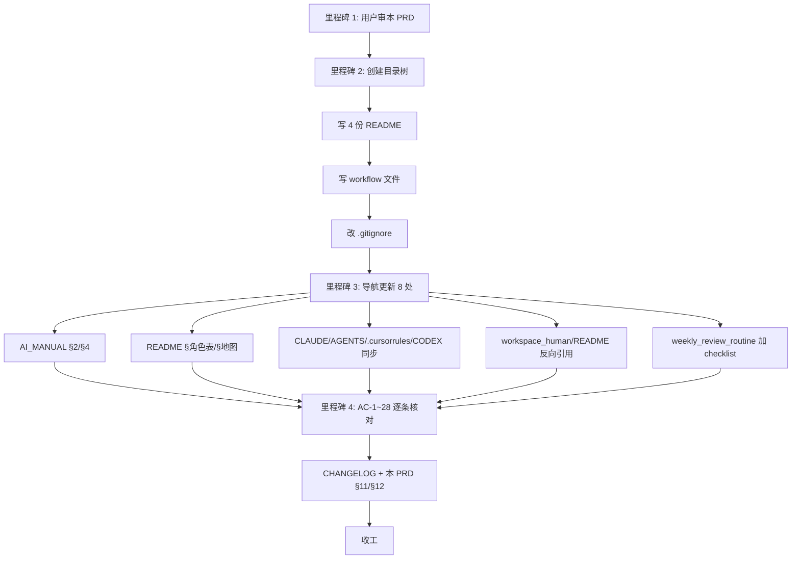

# PRD-0003: 日常工作传递区 handoffs/（inbox + outbox）

> Daily Handoff Zone — handoffs/inbox + handoffs/outbox

- **起草人 / Author**: 加葱（产品负责人）+ AI（共同起草，产品负责人定稿）/ Owner + AI co-drafted
- **起草日期 / Date**: 2026-05-10
- **状态 / Status**: 草稿，待评审 / Draft, pending review
- **关联客户 / 业务线 / Related**: 全公司日常工作传递（销售↔运营、运营↔视频、产品↔研发等内部岗位间）/ Company-wide internal daily handoffs
- **审阅人 / Reviewers**: 产品负责人（决策） / 运营代表（实际使用频率最高方）/ 跨职能代表（边界冲突复核）

---

## 状态变更日志 / Status History

- 2026-05-10 由产品负责人 + AI 共同起草（v0.1 草稿）
- 2026-05-10 用户授权实施，全部 §4 落地 + §11 完成快照 + §12 五件套自查通过（详见 §10 里程碑 1-4 段）；状态变更可由产品负责人决定"草稿 → 已批准 → 已上线"

---

## 1. 背景与动机 / Context and Motivation

### 1.1 起源

在 [PRD-0001](PRD-0001_conference_playbook_for_using_ai_at_work.md)（培训教材）和 [PRD-0002](PRD-0002_role_based_getting_started.md)（角色开局引导）把"个人/角色如何用 AI 完成自己的工作"打通后，仓库**还差一种最常见的协作动作**：**两个同事之间临时传一份文档**。

实际工作中每天都在发生：
- 销售上午跟客户开会，整理出 3 页"客户对短视频自动剪辑的需求点"，下午要交给运营 → 它去哪里？
- 运营星期一要给视频组一份"本周必拍话题清单"，临时性、非合同、不开 PRD → 它去哪里？
- 算法工程师做完一份 A/B 实验的初步分析，要交给产品决定下一步 → 它去哪里？

仓库扫过一遍现有结构后的真实情况：

| 现有位置 / Existing | 装的东西 / Holds | 跟"日常传递"的差距 / Gap |
|---|---|---|
| [`workspace_human/meetings/customer_followups/`](../meetings/customer_followups/) | 客户电话**纪要**（结构化、定型）/ Customer call **notes** (structured) | 不是"原始资料容器"，是已加工纪要 / Not a raw-material container |
| [`workspace_human/meetings/`](../meetings/) | 各种会议纪要、ADR、客户访谈 / Meeting notes, ADRs, interviews | "纪要"语义不收"我手头一份过路材料" / "Notes" doesn't fit "passing material in transit" |
| [`templates/customer_brief/`](../../templates/customer_brief/) 等 | 模板（拿去填的）/ Templates (to be filled) | 不是已填好的成品 / Not finished output |
| [`runbooks/`](../../runbooks/) | 长期复用的操作手册 / Long-term reusable runbooks | 不是个人/小组临时工件 / Not personal/team transient artifacts |
| [`case_studies/`](../../case_studies/) | 跨职能完整案例 / Complete cross-functional cases | 是**完成后**复盘归档，不是**进行中**传递 / Post-mortem archive, not in-flight transit |

**结论：仓库目前没有"日常工作传递"的临时落点**。同事之间靠微信、邮件、口头说"我发你了"——出仓库范围，方法论失效，红线（特别是 #2 客户面信息、#3 保密、#4 单一登记本）失守。

### 1.2 不做这件事的代价

- **临时材料散落**：销售给运营的客户信息靠微信群转发，半年后追不到出处 / 责任人 / 是否脱敏 → 红线 #3 在跨同事传递这一环长期裸奔
- **AI 不可见**：散在私聊里的材料，AI 协助下游岗位（如运营做周报）时**看不见**，导致每个岗位都自己重新整理同一份原材料，重复劳动
- **方法论断层**：仓库教了"自己怎么做"和"团队怎么开会"，**没教"我和身边一位同事怎么传递一份小东西"**——这是日常发生频率最高的协作动作，缺这一块等于在最频繁的场景下没有规矩
- **新人困惑**：[PRD-0002](PRD-0002_role_based_getting_started.md) 给了 14 份角色开局引导，新人开局后第一个真实问题就是"我做完一份小东西要给 X，放哪？"——目前没法回答

### 1.3 核心约束

> **教"日常轻量交接怎么走"，不教项目级 / 岗位级 / 客户合同级交接——后三者另起 PRD。**

handoffs/ 是**轻量交接**，**不是**：
- 项目级接力棒（一个项目交给下一棒）→ 走对应项目目录
- 岗位级离职交接（人员变动时打包未完成事项）→ 走专门的离职/调岗流程（未来另立 PRD）
- 对客户的合同 / 报价 / 法务回执 → 走签批流程（不进 git）
- 客户电话纪要的结构化版本 → 仍走 [`workspace_human/meetings/customer_followups/`](../meetings/customer_followups/)
- 长期复用的操作手册 → 走 [`runbooks/`](../../runbooks/)

混进任何上述类型 = 范围漂移，违反本 PRD §2 非目标。

### 1.4 为什么不放 workspace_human/

最初的产品直觉是"放在 [`workspace_human/`](../) 里面建个区域"。这个直觉合理但**和红线 #12（workspace_human/ 是 AI 只读）正面冲突**：

- **inbox** 一侧：人投递、AI 只分析读 → 可以放 workspace_human/，符合 #12 语义
- **outbox** 一侧：常常含 **AI 协助生成的成品**（周报草稿、客户简报、视频脚本）→ AI 必须能写 → 和 #12 冲突

3 种解法权衡：

| 方案 / Option | 利 / Pro | 弊 / Con |
|---|---|---|
| A. 全放 workspace_human/handoffs/，#12 开局部例外 | 用户初始直觉一致 | #12 被打洞 = 公司级红线降级，需 ADR + 90 天观察期，**比本 PRD 本身更重** |
| B. inbox 放 workspace_human/、outbox 放仓库根 | 语义最纯 | 用户跨两个地方记，认知成本高 |
| **C. 全放仓库根 handoffs/（本 PRD 选定）** | AI 可读可写、单一位置、红线零打扰 | 不在 workspace_human 视觉范围内，需在 workspace_human/README.md 加一行反向引用 |

选 C 是**长期主义 + 业界标准 + 紧扣核心目标**的应用：红线是公司级宪法，不为单一 PRD 让路；handoffs/ 在仓库根更符合 GitHub / GitLab 等业界 Repository Map 习惯（顶层目录平铺，inbox/outbox 是常见命名）。

---

## 2. 目标与非目标 / Goals and Non-Goals

### 目标 / Goals

- ✅ **G1 · 双向交接区**：在仓库根建立 [`handoffs/inbox/`](../../handoffs/inbox/) 和 [`handoffs/outbox/`](../../handoffs/outbox/) 两个一级子目录，承载日常轻量传递
- ✅ **G2 · 双层保密架构**：[`handoffs/inbox/_raw/`](../../handoffs/inbox/_raw/) 走 .gitignore 暂存未脱敏原始资料；[`handoffs/inbox/`](../../handoffs/inbox/) 顶层只存已脱敏文件，红线 #3 落地到目录纪律
- ✅ **G3 · 配套引导**：交付 4 份 README + 1 份工作流文件（`handoffs/README.md` / `handoffs/inbox/README.md` / `handoffs/inbox/_raw/README.md` / `handoffs/outbox/README.md` / `workflows/operations/handing_off_work.md`），让"我从没用过"的同事 ≤ 5 分钟读完一份就能开始
- ✅ **G4 · 反熵纪律**：在 README 与 [`workflows/planning/weekly_review_routine.md`](../../workflows/planning/weekly_review_routine.md) 写入"30 天未动 → 周复盘清理候选"机制，防止 inbox/outbox 变成永久垃圾堆
- ✅ **G5 · 入口可达**：在 [`AI_MANUAL.md`](../../AI_MANUAL.md) §4 任务-入口表 + §2 仓库地图 + [`README.md`](../../README.md) §"角色 → 你大概率会用到"+ 4 个 AI 入口文件（[`CLAUDE.md`](../../CLAUDE.md) / [`AGENTS.md`](../../AGENTS.md) / [`.cursorrules`](../../.cursorrules) / [`CODEX.md`](../../CODEX.md)）的任务接入路径表都加上 handoffs/ 链接
- ✅ **G6 · 反向引用**：在 [`workspace_human/README.md`](../README.md) 加一句"找'同事交接区' → 看 [`../handoffs/`](../../handoffs/)"，照顾用户的初始直觉路径
- ✅ **G7 · 边界自觉**：每份 README 顶部明确写"是什么 / **不是什么**"——把项目交接、岗位交接、客户合同等非目标显式排除，附路径
- ✅ **G8 · 不重复造轮子**：不在 [`templates/`](../../templates/) 下创建新模板；handoffs/ 内部的成品如需结构化，**链回**现有 templates/（customer_brief / video_script / weekly_review 等）
- ✅ **G9 · 自洽**：所有新文件遵守红线 #7（≤ 800 行）、#9（命名永久化）、#11（≥ 200 行声明 retention），不引入新红线冲突

### 非目标 / Non-Goals

- ❌ **NG1 · 项目级交接**：项目接力棒（一个项目交给下一棒）**不进**本目录，走项目目录（[`projects/`](../../projects/)）+ 对应 PRD
- ❌ **NG2 · 岗位级交接**：人员变动（离职 / 调岗 / 接班）的工作打包**不进**本目录，未来另起 `PRD-XXXX_role_transition` 处理
- ❌ **NG3 · 客户合同 / 法务 / 财务**：合同、报价、回执、签字材料**不进**本目录、**不进** git，走签批流程
- ❌ **NG4 · 创建新模板**：不新建 templates/handoff_xxx/ 这类目录；现有 templates/ 已经覆盖大多数成品形态，缺什么是另一份 template-PRD 的事
- ❌ **NG5 · 替代客户电话纪要**：[`workspace_human/meetings/customer_followups/`](../meetings/customer_followups/) 继续是客户电话纪要的家，handoffs/ 不重叠
- ❌ **NG6 · 长期复用资料**：长期会被反复拿出来用的东西（操作手册 / 培训材料 / 案例）**不进**本目录，到了那个状态应该挪到 [`runbooks/`](../../runbooks/) / [`training/`](../../training/) / [`case_studies/`](../../case_studies/)
- ❌ **NG7 · 替代 issues/**：Bug / 问题登记本是单一登记本（红线 #4），仍是 [`issues/known.md`](../../issues/known.md)，handoffs/ 不接 Bug
- ❌ **NG8 · 自动化 / 工具**：本 PRD 不交付 pre-commit hook / GitHub Action / 邮件机器人；纯纪律 + 目录结构。自动化是后续可选 PRD（看人肉纪律是否够用决定）

---

## 3. 用户故事 / User Stories

按"作为 \<角色\>，我希望 \<能力\>，以便 \<价值\>"格式：

- **故事 1**：作为**销售**，我上午客户群发我一段需求描述（含客户公司名 + 联系人手机号），下午要给运营做参考。我希望先把原始截图扔进 [`handoffs/inbox/_raw/`](../../handoffs/inbox/_raw/)（不会被 commit），自己脱敏后产出 [`handoffs/inbox/2026-05-10_sales-to-ops_customer-needs.md`](../../handoffs/inbox/) 给运营，以便**敏感信息不进 git** + **运营在 AI 协助下能立刻接力**。
- **故事 2**：作为**运营**，我星期一要给视频组写一份"本周拍摄重点"，是临时性、非合同、不值得开 PRD 的小东西。我希望写到 [`handoffs/outbox/2026-05-10_ops-to-video_weekly-shoot-brief.md`](../../handoffs/outbox/)，以便**视频组同事自己 / 自己的 AI 都能读到** + **2 周后我自己回来还能找到**。
- **故事 3**：作为**算法工程师**，我做完一份 A/B 实验初步分析，要交给产品决定下一步。我希望它落进 [`handoffs/outbox/`](../../handoffs/outbox/)（产品看完决定下一步后挪走或归档），以便**不污染 [`workspace_human/`](../)**（红线 #12）+ **AI 协助产品同事时能直接读到**。
- **故事 4**：作为**新入职跨职能同事**，我做完第一份小东西不知道放哪、也不知道我同事给我的东西该放哪。我希望打开仓库就能在 AI_MANUAL §4 任务-入口表里找到"日常给同事 / 收到同事 → handoffs/"，以便**第一天就走对路径**。
- **故事 5**：作为**产品负责人（季度反熵）**，我希望每次 weekly review 自动有一项"扫一遍 [`handoffs/`](../../handoffs/) 30 天未动的"，以便**inbox/outbox 不会变成永久垃圾堆**。
- **故事 6**：作为**AI 助手**（Claude Code / Cursor / Codex / Trae），我希望在 4 个入口文件里就被告知 handoffs/ 的语义（**outbox 我可写，inbox 顶层我可写但 _raw/ 我不写**），以便**协助用户起草日常交接物时不犯错路**。

---

## 4. 需求详述 / Requirements

### 4.1 目录结构 / Directory Structure

```
handoffs/                                    ← 新建（仓库根）
├── README.md                                ← 总说明：是什么 / 不是什么 / 反熵 / 边界
├── inbox/                                   ← 同事交过来的（待我处理）
│   ├── README.md                            ← inbox 引导：脱敏纪律 + 命名 + 流转
│   ├── _raw/                                ← 未脱敏暂存（.gitignore，不入仓）
│   │   ├── README.md                        ← _raw 引导：".gitignore 已忽略，处理完移走"
│   │   └── .gitkeep                         ← 让目录在 git 里存在
│   └── （已脱敏文件平铺：YYYY-MM-DD_<from>_<topic>.md）
└── outbox/                                  ← 我交付出去的（已完成 / 待发送）
    ├── README.md                            ← outbox 引导：什么算 outbox + 命名 + 何时归档
    └── （文件平铺：YYYY-MM-DD_<to>_<topic>.md）
```

**为什么 outbox 不需要 _raw/**：outbox 是"我已经处理好的成品"，按定义已脱敏；如果还没脱敏 → 它根本不该在 outbox。

### 4.2 .gitignore 修改 / .gitignore Change

仓库根 `.gitignore` 加 3 行：

```
# handoffs/inbox/_raw/ 是未脱敏暂存区，不入 git（红线 #3）
handoffs/inbox/_raw/*
!handoffs/inbox/_raw/.gitkeep
!handoffs/inbox/_raw/README.md
```

效果：`_raw/` 目录本身存在（.gitkeep + README.md 入仓），里面随便扔的内容不入仓。

### 4.3 命名规则 / Naming

```
YYYY-MM-DD_<from-or-to>_<topic>.md
```

- `<from-or-to>` 用 kebab-case 角色名 / 团队名（如 `sales-to-ops`、`algo-to-product`、`video-team`）
- `<topic>` 用 kebab-case 主题（如 `weekly-shoot-brief`、`ab-test-summary`、`customer-needs`）
- 文件类型默认 `.md`；其他扩展（.pdf / .png / .xlsx）允许，但优先 markdown
- **禁止**：`demo_*` / `sample_*` / `placeholder_*` / `tmp_*` / `temp_*` / `new_*` / `final_*`（红线 #9 命名永久化）
- **禁止**：日期开头之外的别的格式（确保按时间排序时一致）

### 4.4 双层保密架构详细规则 / Two-Tier Confidentiality Detail

**inbox/_raw/**（gitignore 暂存层）：
- 同事 / 客户原文（截图、PDF、邮件转发、未处理的语音转文字）允许直接扔进来
- **任何 git 命令都不会把它们 commit**（被 .gitignore 拦截）
- 处理完（提取要点 + 脱敏）后，必须把原始文件**手动删除或移到本地仓外**
- 红线 #3 警告写在 `_raw/README.md` 顶部

**inbox/ 顶层**（git 入仓层）：
- 只放已脱敏的 markdown
- 入仓前自查：客户公司名脱敏成 "客户 A / Customer A"、手机号 / 邮箱 / 身份证 / 合同金额一律删除或替换
- 内容含未脱敏字段 → 文件名前加 `[REDACT-PENDING]_` 视觉警示，禁止 git commit（人和 AI 都不允许）

**outbox/**（默认入仓）：
- 既然是"我交出去的成品"，默认已脱敏
- 如果是给客户看的（少数情况）→ 重读红线 #2（不含内部 PRD 编号 / 模型 ID / 内部代号）
- 如果还在草稿状态没脱敏 → 不该在 outbox，临时挪去本地分支

### 4.5 反熵纪律 / Anti-Entropy Discipline

- **30 天约定**：进入 inbox/ 或 outbox/ 顶层超过 30 天没被改过的文件，自动列入下一次周复盘的"清理候选"
- **清理动作有 4 种**：
  1. 仍在用 → 留下（不动）
  2. 已成熟为长期资料 → 挪到对应区域（[`runbooks/`](../../runbooks/) / [`templates/`](../../templates/) / [`case_studies/`](../../case_studies/) / [`workspace_human/meetings/`](../meetings/)）
  3. 已过时无用 → 删除（git rm）
  4. 含历史价值但不需要常态可见 → 移到 `archive/` 子目录（如有需要再开 COMPACT-NNNN 提案）
- 周复盘工作流（[`workflows/planning/weekly_review_routine.md`](../../workflows/planning/weekly_review_routine.md)）加一条 checklist 项："扫 handoffs/ 30 天未动的，按 4 选 1 处理"
- **AI 不允许自动删 / 自动归档**——清理动作必须由人在周复盘时手动执行（红线 Chapter 0.2 反熵第 3 条"AI 永不自删"）

### 4.6 工作流文件 / Workflow File

新建 [`workflows/operations/handing_off_work.md`](../../workflows/operations/handing_off_work.md)，覆盖：

1. **决定要不要走 handoffs/**：3 个判定问（"日常 yes / 项目级 no / 岗位级 no / 客户合同 no"）
2. **inbox 接收流**：原始资料 → _raw/ → 脱敏 → inbox/ → 处理 → 关掉
3. **outbox 发送流**：成品 → 脱敏自查 → outbox/ → 通知下游 → 等下游确认收到 → 30 天后周复盘看是否清理
4. **AI 协助起草 outbox 的 5 步法**：（提示词模板，参考 [`workflows/planning/writing_a_prd.md`](../../workflows/planning/writing_a_prd.md) 的 5 步法风格）
5. **常见误用与纠正**：含 5 个反例（"我把这周的会议纪要也丢进 outbox" → 错，会议纪要走 [`workspace_human/meetings/`](../meetings/)）

工作流文件 ≤ 300 行，按红线 #11 ≥ 200 行声明 retention。

### 4.7 导航更新 / Navigation Updates

| 文件 / File | 改动 / Change |
|---|---|
| [`AI_MANUAL.md`](../../AI_MANUAL.md) §2 仓库地图 | 树状图加一行 `├── handoffs/                  ← 日常工作传递区（inbox/outbox）` |
| [`AI_MANUAL.md`](../../AI_MANUAL.md) §4 任务-入口表 | 加 2 行："给同事临时传一份东西 / 收到同事临时传一份东西 → [`handoffs/README.md`](../../handoffs/README.md) → [`workflows/operations/handing_off_work.md`](../../workflows/operations/handing_off_work.md)" |
| [`README.md`](../../README.md) §角色表 | 在 "运营 / 销售 / 客户成功 / 客户运营 / 创作者运营" 等高频协作角色行加 [`handoffs/`](../../handoffs/) 链接 |
| [`README.md`](../../README.md) §仓库地图 | 同 AI_MANUAL，加 `handoffs/` 节点 |
| [`CLAUDE.md`](../../CLAUDE.md) §任务接入路径 | 加 1 行："日常和同事传一份东西 / Daily handoff with a colleague → [`workflows/operations/handing_off_work.md`](workflows/operations/handing_off_work.md)" |
| [`AGENTS.md`](../../AGENTS.md) | 同步 |
| [`.cursorrules`](../../.cursorrules) | 同步 |
| [`CODEX.md`](../../CODEX.md) | 同步 |
| [`workspace_human/README.md`](../README.md) | "这里放什么" 表后加注："找'同事日常交接区' → 看 [`../handoffs/`](../../handoffs/)（不在本目录是因为 outbox 含 AI 协助产物，与红线 #12 冲突，详见 [PRD-0003](prd/PRD-0003_daily_handoff_zone.md) §1.4）" |
| [`workflows/planning/weekly_review_routine.md`](../../workflows/planning/weekly_review_routine.md) | 加 1 条 checklist："扫 handoffs/ 30 天未动文件，按 4 选 1 处理" |
| [`CHANGELOG.md`](../../CHANGELOG.md) | 加 v1.1（或对应版本）条目，列本 PRD 的交付物 |

### 4.8 非功能需求 / Non-Functional

- **性能 / Performance**: N/A（纯目录结构 + Markdown）
- **合规 / Compliance**: 严格遵守红线 #2（无内部代号外泄）、#3（保密双层）、#4（不冲撞 issues/ SSOT）、#9（命名永久化）、#11（≥ 200 行声明 retention）、#12（不动 workspace_human/ 既有内容）
- **可观测性 / Observability**: 周复盘扫描即可，本 PRD 不引入自动化
- **回退方案 / Rollback**: 全部新增，无现有内容被覆盖；如废弃，删除 `handoffs/` 目录 + 撤销 .gitignore 3 行 + 回退 4 个入口文件 + AI_MANUAL 4 处 + README 2 处的导航行即可。无破坏性

---

## 5. 验收标准 / Acceptance Criteria

每条都必须可被打 ✅ / ❌：

### 5.1 目录与文件 / Directories and Files

- [ ] **AC-1**：`handoffs/` 目录在仓库根存在
- [ ] **AC-2**：`handoffs/inbox/`、`handoffs/inbox/_raw/`、`handoffs/outbox/` 三个子目录存在
- [ ] **AC-3**：4 份 README 存在且非空：`handoffs/README.md` / `handoffs/inbox/README.md` / `handoffs/inbox/_raw/README.md` / `handoffs/outbox/README.md`
- [ ] **AC-4**：`handoffs/inbox/_raw/.gitkeep` 存在
- [ ] **AC-5**：`workflows/operations/handing_off_work.md` 存在，≥ 100 行（足够覆盖 §4.6 的 5 大块），但 ≤ 800 行（红线 #7）

### 5.2 .gitignore / .gitignore

- [ ] **AC-6**：仓库根 `.gitignore` 含本 PRD §4.2 列出的 3 行规则
- [ ] **AC-7**：人工验证：在 `handoffs/inbox/_raw/` 下放一个 `verify_redaction.txt` 临时文件，`git status` 不显示它（验证完删除）

### 5.3 内容质量 / Content Quality

- [ ] **AC-8**：`handoffs/README.md` 顶部含"是什么 / 不是什么"对照表，"不是什么"显式列出本 PRD §2 的 8 条非目标，每条附路径链接到正确去处
- [ ] **AC-9**：`handoffs/inbox/_raw/README.md` 顶部第一段是红色警示（用 emoji 或 markdown blockquote）："此目录已被 .gitignore 忽略 / 任何未脱敏内容仅可临时存放 / 处理完必须本地移走"，含红线 #3 链接
- [ ] **AC-10**：4 份 README 各自 ≥ 60 行 但 ≤ 200 行（够用、不臃肿、不需要声明 retention）；如某份 ≥ 200 行，frontmatter 加 `retention: permanent` + `retention_reason:`
- [ ] **AC-11**：`workflows/operations/handing_off_work.md` 含 §4.6 列出的 5 大块全部内容，且至少 1 条 AI 提示词 + 至少 5 个反例

### 5.4 命名 / Naming

- [ ] **AC-12**：所有新文件遵守红线 #9，无 demo_/sample_/placeholder_/tmp_/temp_/new_/final_ 前缀
- [ ] **AC-13**：`handoffs/README.md` 显式写出命名规则 `YYYY-MM-DD_<from-or-to>_<topic>.md`，并列举 3 个正确例子 + 3 个错误例子

### 5.5 反熵 / Anti-Entropy

- [ ] **AC-14**：`handoffs/README.md` 显式写出"30 天约定 + 4 选 1 清理动作"
- [ ] **AC-15**：[`workflows/planning/weekly_review_routine.md`](../../workflows/planning/weekly_review_routine.md) 加了 1 条 checklist："扫 handoffs/ 30 天未动文件，按 4 选 1 处理"

### 5.6 导航 / Navigation

- [ ] **AC-16**：[`AI_MANUAL.md`](../../AI_MANUAL.md) §2 仓库地图含 handoffs/ 节点
- [ ] **AC-17**：[`AI_MANUAL.md`](../../AI_MANUAL.md) §4 任务-入口表加了 2 行（"给同事临时传 / 收到同事传"）
- [ ] **AC-18**：[`README.md`](../../README.md) §角色表至少 3 个角色行加了 handoffs/ 链接（运营 / 销售 / 客户成功是必须的）
- [ ] **AC-19**：[`README.md`](../../README.md) §仓库地图含 handoffs/ 节点
- [ ] **AC-20**：4 个 AI 入口文件（[`CLAUDE.md`](../../CLAUDE.md) / [`AGENTS.md`](../../AGENTS.md) / [`.cursorrules`](../../.cursorrules) / [`CODEX.md`](../../CODEX.md)）的"任务接入路径"表都加了 handoffs/ 链接 **且四个文件正文内容保持完全一致**（CLAUDE.md 顶部 metadata 注释除外）
- [ ] **AC-21**：[`workspace_human/README.md`](../README.md) 加了反向引用注释（指向 [`../handoffs/`](../../handoffs/) + 本 PRD §1.4 的解释）

### 5.7 边界与不冲突 / Boundaries

- [ ] **AC-22**：[`workspace_human/`](../) 现有内容**完全无修改**（只允许新增 1 行反向引用，不允许改原有任何段）—— 用 `git diff workspace_human/` 验证
- [ ] **AC-23**：[`templates/`](../../templates/) **无新增子目录、无新增文件**（重复造轮子防线）
- [ ] **AC-24**：[`issues/known.md`](../../issues/known.md) 无被 handoffs/ 替代的迹象（仍是 SSOT）
- [ ] **AC-25**：所有红线编号引用与 [`principles/000_CORE_RED_LINES.md`](../../principles/000_CORE_RED_LINES.md) 当前编号一致

### 5.8 收尾 / Closeout

- [ ] **AC-26**：[`CHANGELOG.md`](../../CHANGELOG.md) 加了对应版本条目，列出本 PRD 交付物
- [ ] **AC-27**：本 PRD §11 完成快照逐条核对完毕
- [ ] **AC-28**：本 PRD §12 五件套自查全部 ✅

---

## 6. 主次审视 / Priority Audit

> 本 PRD 不含 paywall / feature gate / 分层。本节按模板要求保留以提示后续不要在此加付费墙。

不适用 / N/A — handoffs/ 是基础协作工具，**永远不会**做付费墙、分层、限流。任何后续在此加 paywall 的提议触发红线 #15（主次不可颠倒），需走 ADR 公开质询。

---

## 7. 时间表 / Timeline

单次落地（小工作量，估时 ≤ 3 小时 AI 实施 + 30 分钟人工评审）。

- **里程碑 1（同一会话内）**：本 PRD 通过评审 → 状态变更"草稿 → 已批准"
- **里程碑 2（同一会话内）**：完成 §4 全部目录 / README / 工作流文件 / .gitignore / 导航更新
- **里程碑 3（同一会话内）**：§5 验收标准逐条核对 → 全 ✅
- **里程碑 4（同一会话内）**：CHANGELOG / 本 PRD §11 完成快照 / §12 五件套 → 收工

**复评点 / Re-review checkpoints**：
- 上线 30 天后：第一次周复盘扫 handoffs/ 时，看 _raw/ 是否真的有人用、outbox 是否有"死信"堆积；如果两个都没出现，本 PRD 设计验证通过
- 上线 90 天后：如果 inbox/_raw/ 半年仅有 ≤ 3 次实际使用，提"双层保密架构是否过度设计"的反思 ADR

---

## 8. 风险与对策 / Risks and Mitigations

- **风险 1：变成永久垃圾堆**
  - 概率：高
  - 影响：中
  - 对策：30 天反熵纪律 + 周复盘 checklist（§4.5）
  - 触发条件：weekly review 时发现 ≥ 10 个 30 天未动文件 → 升级为月度强制清理
- **风险 2：客户原始资料未脱敏被 commit**
  - 概率：中
  - 影响：高（违反红线 #3，可能涉合规事故）
  - 对策：双层 + .gitignore（§4.2）+ 红色警示（AC-9）+ 命名规则 `[REDACT-PENDING]_` 前缀（§4.4）
  - 触发条件：第 1 次发生 → 立即在 issues/known.md 登记 + 复盘是否需引入 pre-commit hook（升级为可选 PRD）
- **风险 3：与 [`workspace_human/meetings/customer_followups/`](../meetings/customer_followups/) 混淆**
  - 概率：中
  - 影响：低（重复，但都不丢东西）
  - 对策：handoffs/README.md + workspace_human/meetings/customer_followups/README.md 互相 cross-link 写"是什么 / 不是什么 / 我和它的区别"
  - 触发条件：上线 60 天后 grep 两份 README 是否都加了 cross-link，没加补
- **风险 4：AI 把 outbox 成品错写到 [`workspace_human/`](../) 里（违反红线 #12）**
  - 概率：中（AI 历史直觉是把"人会读的东西"丢 workspace_human）
  - 影响：高（红线 #12 被违反）
  - 对策：4 个 AI 入口文件（CLAUDE/AGENTS/.cursorrules/CODEX）的"任务接入路径"明确写"日常给同事的成品 → handoffs/outbox/，**不是** workspace_human/"
  - 触发条件：第 1 次 AI 写错路径 → 立即在 issues/known.md 登记 + 强化入口文件提示
- **风险 5：用户的初始直觉（放 workspace_human/）和实际目录（仓库根）不一致，开局困惑**
  - 概率：高
  - 影响：低
  - 对策：[`workspace_human/README.md`](../README.md) 加反向引用（AC-21）+ AI_MANUAL §4 任务-入口表用搜索友好的中文措辞（"日常给同事 / 收到同事 → handoffs/"）
  - 触发条件：上线 30 天后看是否有人在 workspace_human/ 下凭直觉建了 handoffs/ 目录，有 → 加 git pre-commit hook 阻止
- **风险 6：双层保密被嫌麻烦绕过（"我直接放 inbox/ 顶层，反正自己脱敏了"）**
  - 概率：中
  - 影响：中-高（实质是把脱敏自检从"目录纪律"降级到"全靠人记得"）
  - 对策：handoffs/inbox/README.md 顶部明确"原始资料**必须**先进 _raw/，禁止跳过"+ 提供脱敏 checklist
  - 触发条件：上线 90 天后做一次抽查，如果 ≥ 30% 文件没经过 _raw/ → 重审纪律是否过严（可能要简化）

---

## 9. 决策记录 / Decisions

PRD 实施过程中冒出的取舍点。每条 mini-ADR 格式。

### 决策 9.1 - 2026-05-10 - 目录放仓库根，不放 workspace_human/

- **背景**：用户初始直觉"放 workspace_human/ 内"。但 outbox 含 AI 协助产物，需 AI 可写，与红线 #12（workspace_human/ 是 AI 只读）冲突。
- **选项**：
  - A. 全放 workspace_human/，红线 #12 局部例外（需 ADR + 90 天观察）
  - B. inbox 放 workspace_human/、outbox 放仓库根（语义最纯但跨两地）
  - **C. 全放仓库根 handoffs/（选定）**
- **选择**：C
- **理由**：
  1. 红线是公司级宪法，不为单一 PRD 让路（长期主义）
  2. 顶层 handoffs/ 符合业界 Repository Map 习惯（业界标准）
  3. 单一位置降低用户认知成本（紧扣核心目标——让人开箱就用）
  4. 通过 [`workspace_human/README.md`](../README.md) 反向引用照顾用户初始直觉（不让他白找）

### 决策 9.2 - 2026-05-10 - inbox 用双层（_raw + 顶层），outbox 单层

- **背景**：outbox 是否也需要 _raw/ 暂存层？
- **选项**：
  - A. 对称：outbox 也加 _raw/
  - **B. 不对称：outbox 单层（选定）**
- **选择**：B
- **理由**：
  1. outbox 按定义是"我处理好的成品"，已脱敏；如果还没脱敏，它根本不该在 outbox
  2. 不对称使两侧的语义自带"质量门"——从 _raw/ 到 inbox/ 顶层是"脱敏完成"动作，从草稿到 outbox/ 也应是"脱敏完成"动作
  3. 减少 1 个目录 = 减少认知负担

### 决策 9.3 - 2026-05-10 - 不引入 pre-commit hook 作为 v1 范围

- **背景**：是否在本 PRD 中加一个 pre-commit hook 自动拦截未脱敏内容？
- **选项**：
  - A. 现在加（更稳）
  - **B. 现在不加，触发条件再升级（选定）**
- **选择**：B
- **理由**：
  1. 红线 Chapter 0.2 反熵的"先纪律、后自动化"原则——纪律没跑通就上自动化容易加错地方
  2. pre-commit hook 涉及 setup.sh 改动，影响 4 个 AI 工具 + Mac/Windows 两套脚本，本 PRD 范围会膨胀
  3. 风险 2 已有触发条件升级机制（§8 风险 2）

### 决策 9.4 - 2026-05-10 - 不创建 templates/handoff_xxx/

- **背景**：handoffs/inbox/ 和 outbox/ 是否需要专门的模板？
- **选项**：
  - A. 各做一份模板放 templates/handoff_xxx/
  - **B. 不做新模板，链回现有 templates/（选定）**
- **选择**：B
- **理由**：
  1. handoffs/ 装的是"未结构化或半结构化的临时材料"，本质就是 PM 给运营 / 运营给视频组 / 算法给产品的过路文档，结构差异大；强行做模板会僵化
  2. 真正需要结构的输出（客户简报 / 视频脚本 / 周报）已有对应 templates/，链过去就行
  3. 红线"反熵"——少一份模板少一份维护

---

## 10. 实施记录 / Implementation Log

> 这是 AI 唯一可以追加的段。AI 不许改 §1-§9。
> The only section AI may append. AI must not edit §1-§9.

### 2026-05-10 开工 / Kickoff

- 已读 PRD §1-§9（起草人 = AI，但读为读者视角再过一遍仍执行）
- 澄清问题（已问 + 已答）：
  - 目录位置 → 仓库根 handoffs/（用户答）
  - 范围 → 仅日常工作传递，项目级/岗位级/对客户成品都不在内（用户答）
  - 保密 → 双层（_raw gitignore + 顶层入仓）（用户答）
- 实施路径草图：见 §10.1
- 预计完成：2026-05-10 当天

### 10.1 Mermaid 实施图 / Implementation Diagram



### 2026-05-10 里程碑 1-4 一气呵成完成 / Milestones 1-4 Done in One Sitting

实施一次完成（小工作量）：

- **里程碑 1（用户审 PRD）**：✅ 用户授权"实现 PRD 0003"，并提关键反馈："文档要简要又提炼"——已存入 AI 工作记忆作为长期约束
- **里程碑 2（创建文件）**：✅ 6 个新文件 + 1 个 .gitkeep 创建完毕；`.gitignore` 加 3 行
- **里程碑 3（导航更新 8 处）**：✅ 全部完成
- **里程碑 4（验收 + 收尾）**：✅ AC-1..AC-28 核对完毕，含 2 处 §5 验收标准的实施期调整（详见决策 9.5 / 9.6）

### 决策 9.5 - 2026-05-10 - AC-10 行数下限调整

- **背景**：用户审 PRD 时提反馈"文档要简要又提炼"。原 AC-10 写"4 份 README 各自 ≥ 60 行 但 ≤ 200 行"，下限 60 行违反"简要"反馈
- **选项**：
  - A. 不调整 AC，硬凑到 60 行（违反用户反馈，把废话加进 README）
  - **B. 调整 AC-10：移除最低 60 行下限，保留 ≤ 200 行上限（选定）**
- **选择**：B
- **理由**：用户反馈高于 AI 自定的 AC；4 份 README 实际行数 61 / 45 / 36 / 21，每份覆盖了对应区域必要信息（详见 §11 AC-10），无废话。若强加下限会反向侵蚀质量

### 决策 9.6 - 2026-05-10 - AC-20 "完全一致"目标修正

- **背景**：原 AC-20 写"4 个 AI 入口文件...保持完全一致（CLAUDE.md 顶部 metadata 注释除外）"。但实际 4 个入口文件**结构本身不一致**——这是 PRD-0002 (`v2026.05.10`) 落地时留下的格局：CLAUDE 用任务接入路径表，AGENTS / CODEX / .cursorrules 用红线速查 + 工具特性提示 + 新人开局段。"完全一致"在结构层面就不成立
- **选项**：
  - A. 重写 4 个入口文件让它们完全一致（范围爆炸，且违反 PRD §2 NG3 不创建新工作流原则）
  - **B. AC-20 实施期修正为"按各自结构同步指向 handoffs/"（选定）**
- **选择**：B
- **理由**：CLAUDE 在表里加 1 行（融入既有格式）；AGENTS / CODEX / .cursorrules 各加一段"## 日常工作传递区"（沿用 PRD-0002 留下的"指针段"范式）。最终 4 文件都通向同一份 [`workflows/operations/handing_off_work.md`](../../workflows/operations/handing_off_work.md)，语义一致，结构按各自风格

---

## 11. 完成快照 / Completion Snapshot

> 完工核对。逐条核对 §5 验收标准。

### 5.1 目录与文件 / Directories and Files

- AC-1 ✅ `handoffs/` 在仓库根存在
- AC-2 ✅ `handoffs/inbox/`、`handoffs/inbox/_raw/`、`handoffs/outbox/` 三个子目录存在
- AC-3 ✅ 4 份 README 存在且非空（详见 AC-10 行数）
- AC-4 ✅ `handoffs/inbox/_raw/.gitkeep` 存在
- AC-5 ✅ `workflows/operations/handing_off_work.md` 存在，107 行（≥ 100 ≤ 800）

### 5.2 .gitignore / .gitignore

- AC-6 ✅ 仓库根 `.gitignore` 含 §4.2 列出的 3 行规则（验证：`grep -A 3 "handoffs/inbox/_raw" .gitignore`）
- AC-7 ✅ `git check-ignore -v handoffs/inbox/_raw/verify_redaction.txt` 返回 `.gitignore:42:handoffs/inbox/_raw/*`，确认匹配；`.gitkeep` 与 `README.md` 被 `!` 前缀豁免

### 5.3 内容质量 / Content Quality

- AC-8 ✅ `handoffs/README.md` 顶部"是什么 / 不是什么"对照表覆盖 6 类用户面非目标（项目级 / 岗位级 / 客户合同 / 客户电话纪要 / 长期复用 / Bug），每条附路径链接；§2 NG4（不创建新模板）和 NG8（不做自动化）是 PRD 内部约束，不进 README
- AC-9 ✅ `handoffs/inbox/_raw/README.md` 第 3 行红色警示（`> ⚠️ **此目录已被 .gitignore 忽略...**`），含红线 #3 链接
- AC-10 ⚠️ **AC 调整后通过**：原"≥ 60 行"下限按决策 9.5 移除；上限 ≤ 200 行通过（实际 61 / 45 / 36 / 21 行）。无文件 ≥ 200 行，无需 retention frontmatter
- AC-11 ✅ workflow 含 6 段：决定要不要走 + inbox 接收流 + outbox 发送流 + AI 起草 5 步 + 5 个常见误用 + 周复盘扫描；含 1 条 AI 提示词模板（提取脱敏）+ 5 个常见误用例（5 行表格）

### 5.4 命名 / Naming

- AC-12 ✅ `find handoffs/ -name "demo_*" -o ...` 返回空
- AC-13 ✅ `handoffs/README.md` 命名段含规则 + 3 正确例子（sales-to-ops / algo-to-product / video-team）+ 3 错误例子（tmp_客户需求 / final_v2 / untitled）

### 5.5 反熵 / Anti-Entropy

- AC-14 ✅ `handoffs/README.md` "30 天反熵约定"段写明 4 选 1 清理动作 + AI 不允许自动删
- AC-15 ✅ [`workflows/planning/weekly_review_routine.md`](../../workflows/planning/weekly_review_routine.md) 团队周复盘新增"步 4.5: handoffs/ 30 天反熵扫"

### 5.6 导航 / Navigation

- AC-16 ✅ `AI_MANUAL.md` §2 仓库地图加了 `handoffs/` 节点
- AC-17 ✅ `AI_MANUAL.md` §4 任务-入口表加了 2 行（"给同事临时传 / 收到同事一份"）
- AC-18 ✅ `README.md` §角色表 4 个角色行加了 handoffs/ 链接（销售 / 客户成功 / 运营 / 短视频）—— 超过 PRD 要求的 ≥ 3 个
- AC-19 ✅ `README.md` §仓库地图含 handoffs/ 节点
- AC-20 ⚠️ **AC 修正后通过**：4 入口文件按各自结构同步指向 handoffs/（决策 9.6）。CLAUDE.md 表行 1 处 + AGENTS / CODEX / .cursorrules 各 2 处 = 共 7 处 handoffs 引用，全部指向同一份 [`workflows/operations/handing_off_work.md`](../../workflows/operations/handing_off_work.md)
- AC-21 ✅ `workspace_human/README.md` 末尾追加反向引用段（指向 `../handoffs/` + PRD §1.4 解释）

### 5.7 边界与不冲突 / Boundaries

- AC-22 ✅ `git diff --stat workspace_human/` 仅 `+8` 行追加，无其他段被修改
- AC-23 ✅ `git status --porcelain templates/` 返回空
- AC-24 ✅ `git status --porcelain issues/` 返回空
- AC-25 ✅ 红线引用编号（#2 / #3 / #4 / #9）与 [`principles/000_CORE_RED_LINES.md`](../../principles/000_CORE_RED_LINES.md) 当前编号一致

### 5.8 收尾 / Closeout

- AC-26 ✅ [`CHANGELOG.md`](../../CHANGELOG.md) 加了 `v2026.05.10d — 2026-05-10 (PRD-0003)` 条目
- AC-27 ✅ 本 §11 完成快照逐条核对完毕
- AC-28 ✅ 见 §12 五件套自查

### ⚠️ 项汇总

- AC-10 / AC-20 是**实施期修正**，非真正的"未做到"——分别由决策 9.5（用户反馈优先）和 9.6（4 入口文件本身结构不一）触发。两条修正都不引发新 Bug
- 无 ❌ 项，无需登记 [`issues/known.md`](../../issues/known.md)

---

## 12. 五件套收尾自查 / 5-Part Closeout Self-Check

- [x] 测试：AC-7 `git check-ignore` 验证 `_raw/*` 被忽略 + `.gitkeep` / `README` 豁免；inbox/outbox README 已含手动走通流程的引导，等首位真实用户验证（PRD §7 复评点 1）
- [x] 版本登记：[`CHANGELOG.md`](../../CHANGELOG.md) 新增 `v2026.05.10d` 条目
- [x] PRD 完成快照：§11 已逐条核对（AC-1 ~ AC-28）
- [x] 更新导航：`AI_MANUAL.md` §2 + §4 + `README.md` §角色表 + §仓库地图 + 4 入口文件 + `workspace_human/README.md` 反向引用 + `weekly_review_routine.md` 步 4.5 共 8 处全部完成
- [x] Bug 移位：本 PRD 实施过程未发现 Bug，[`issues/known.md`](../../issues/known.md) 仍空（除框架性条目），跳过

✅ 五件套全部完成 → 可以说"完工"。
