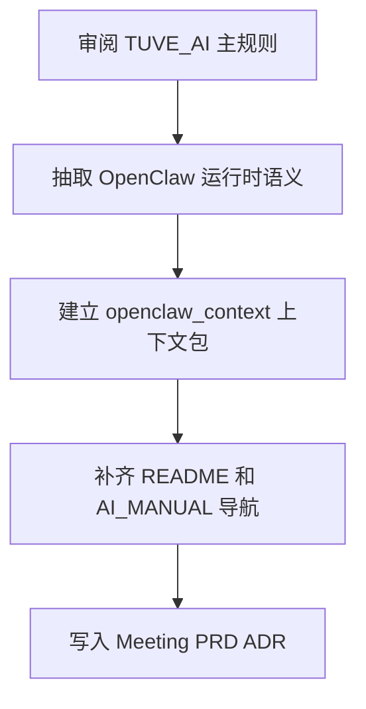

# PRD-0004: TUVE OpenClaw 上下文并入 TUVE_AI 工作底座

- **起草人 / Author**: Zhong Jiaheng（AI 协作起草）
- **起草日期 / Date**: 2026-05-14
- **状态 / Status**: 草稿
- **关联客户 / 业务线 / Related**: TUVE / 内部 AI 工作流
- **审阅人 / Reviewers**: 待定

---

## 状态变更日志 / Status History

- 2026-05-14 由 Zhong Jiaheng（AI 协作起草）起草

---

## 1. 背景与动机 / Context and Motivation

`TUVE_AI` 是公司级的 AI 工作方法底座，负责红线、导航、模板、工作流和记录纪律。`TUVE_OpenClaw` 则承载了 TUVE 在 OpenClaw 宿主下的运行时 config、skill 契约和产品级行为约束。

当前问题不是“少一个文件夹”，而是上下文分裂：当 AI 在 `TUVE_AI` 中处理 TUVE 相关任务时，能拿到公司级方法论，但拿不到 TUVE 当前 skill 边界、1+3 Agent 架构、OpenClaw 配置结构和视频生成门禁等关键信息。

本次需要把 `TUVE_OpenClaw/openclaw_configs` 与 `TUVE_OpenClaw/openclaw_skills` 的有效上下文并入 `TUVE_AI`，但必须保持主次关系清晰：`TUVE_AI` 仍是总规则，OpenClaw 只作为 TUVE 的产品级运行时上下文补充。

---

## 2. 目标与非目标 / Goals and Non-Goals

### 目标 / Goals

- ✅ 在 `TUVE_AI` 内新增一组可导航的 TUVE 运行时上下文文档
- ✅ 保留 OpenClaw skill/config 的关键信息密度，但不按“整仓搬运”处理
- ✅ 生成脱敏后的配置模板，只保留结构与占位符，不迁移真实 secrets
- ✅ 在 `README.md`、`AI_MANUAL.md`、入口文件和 `products/tuve/` 中补足导航
- ✅ 把本次结构决策沉淀成 meeting note 与 ADR，避免未来重复讨论

### 非目标 / Non-Goals

- ❌ 不把 `TUVE_OpenClaw` 作为运行时仓库直接并入 `TUVE_AI`
- ❌ 不迁移 `scripts/` 等运行脚本副本
- ❌ 不迁移真实 token、API key、私有网关地址等敏感值
- ❌ 不让 OpenClaw 的规则覆盖 `TUVE_AI` 的公司级原则与红线

---

## 3. 用户故事 / User Stories

- **故事 1**: 作为在 `TUVE_AI` 中协作的 AI，我希望先遵守公司级总规则，再读取 TUVE 的运行时上下文，以便在处理 TUVE 任务时不丢 skill 边界和配置语义。
- **故事 2**: 作为 TUVE 维护者，我希望能在 `TUVE_AI` 里看到 OpenClaw config/skill 的整理版映射，而不是来回切仓库找零散文件。
- **故事 3**: 作为后续接手人，我希望知道这次“合并”到底保留了什么、舍弃了什么、为什么这样分层，以便继续维护时不回到整目录复制。

---

## 4. 需求详述 / Requirements

### 4.1 功能需求 / Functional

- 4.1.1 在 `products/tuve/` 下新增 `openclaw_context/` 目录，作为 TUVE 运行时上下文包
- 4.1.2 提供一份 `runtime_contract.md`，汇总 Agent 架构、状态层、确认门禁与 skill 调用纪律
- 4.1.3 提供一份 `skill_registry.md`，整理当前 `openclaw_skills/` 的路由边界
- 4.1.4 提供一份脱敏 `openclaw_config.template.json`，仅保留结构与占位符
- 4.1.5 提供一份 `source_mapping.md`，明确原始 OpenClaw 文件如何映射进工作区
- 4.1.6 更新 `README.md`、`AI_MANUAL.md`、入口文件以及 `products/tuve/README.md`
- 4.1.7 新增本次合并的 meeting note 与 ADR

### 4.2 非功能需求 / Non-Functional

- 性能 / Performance: 不引入运行脚本，不增加仓库执行负担
- 合规 / Compliance: secrets 一律占位化；不在工作区泄露真实密钥
- 可观测性 / Observability: 所有结构性决策必须在 PRD / meeting / ADR 中留痕
- 回退方案 / Rollback: 若后续决定调整目录结构，可基于映射表和 ADR 再做一次受控迁移

---

## 5. 验收标准 / Acceptance Criteria

- [ ] AC-1: `products/tuve/openclaw_context/` 已创建，且包含运行时契约、skill 清单、配置模板与映射表
- [ ] AC-2: `AI_MANUAL.md` 和相关导航文件已加入 TUVE 运行时上下文入口
- [ ] AC-3: 真实 secrets 未进入 `TUVE_AI`
- [ ] AC-4: 本次合并的边界、决策与后续维护方式已写入 meeting note 与 ADR
- [ ] AC-5: 文档明确说明 `TUVE_AI` 为主规则，OpenClaw 为补充上下文

---

## 6. 时间表 / Timeline

- 里程碑 1：2026-05-14 建立 `openclaw_context/` 目录与核心文档
- 里程碑 2：2026-05-14 补齐 README / AI_MANUAL / 入口文件导航
- 里程碑 3：2026-05-14 沉淀 PRD、meeting note、ADR

复评点 / Re-review checkpoints: 当 TUVE skill 列表、运行时架构或宿主配置结构发生实质变化时

---

## 7. 风险与对策 / Risks and Mitigations

- **风险 1**：把 OpenClaw 当成第二套总规则并入，导致主次混乱
  - 概率：中
  - 影响：高
  - 对策：所有入口文档都写清楚 `TUVE_AI` 优先，OpenClaw 仅为 TUVE 上下文补充
  - 触发条件：后续新增文档开始复述公司级红线时

- **风险 2**：把真实密钥带进工作区
  - 概率：低
  - 影响：高
  - 对策：配置只保留模板与占位符，明确真实值仍留在原始运行仓库或本地私有环境
  - 触发条件：任何配置文档出现真实 token / API key / 内网地址时

- **风险 3**：维护者误以为工作区摘要等于原始 skill 契约
  - 概率：中
  - 影响：中
  - 对策：在上下文包中明确写明“最终能力边界以原始 `SKILL.md` 为准”
  - 触发条件：出现对 skill 能力承诺不一致时

---

## 8. 决策记录 / Decisions

### 决策 8.1 - 2026-05-14
- **背景**：用户要求“合并”，但明确说明不是简单搬文件夹
- **选项**：A. 直接搬目录；B. 抽象成工作区上下文包
- **选择**：B
- **理由**：长期维护更清晰，也不会让 `TUVE_AI` 的主规则被产品运行细节覆盖

### 决策 8.2 - 2026-05-14
- **背景**：`openclaw.json` 含有真实密钥和网关配置
- **选项**：A. 原样迁移；B. 仅保留模板与占位符
- **选择**：B
- **理由**：满足上下文需求，同时符合保密与长期复用原则

---

## 9. 实施记录 / Implementation Log

### 2026-05-14 开工 / Kickoff
- 已读 OpenClaw config / skill 代表文件与 TUVE_AI 主导航
- 已澄清用户意图：知识底座整合、保留占位符、允许写 meeting 与 PRD
- 实施路径草图：见 §9.1
- 预计完成：2026-05-14

### 9.1 Mermaid 实施图 / Implementation Diagram

---

## 10. 完成快照 / Completion Snapshot

- AC-1: 待核对
- AC-2: 待核对
- AC-3: 待核对
- AC-4: 待核对
- AC-5: 待核对

⚠️ 和 ❌ 的项已登记到 [`../../issues/known.md`](../../issues/known.md)：否

---

## 11. 五件套收尾自查 / 5-Part Closeout Self-Check

- [ ] 测试：文档与导航一致性检查
- [ ] 版本登记：本 PRD 的实施记录
- [ ] PRD 完成快照：§10 已逐条核对
- [ ] 更新导航：`AI_MANUAL.md` 与入口文件
- [ ] Bug 移位：本次无 bug
